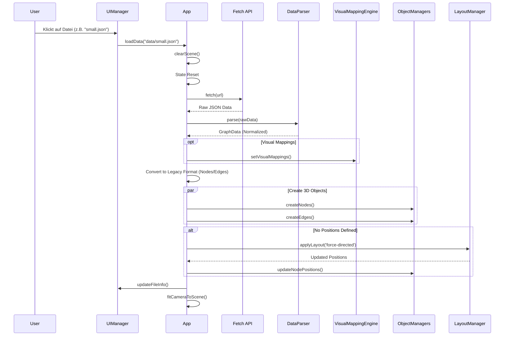

# Architektur-Diagramme

## 3.1 Laden von JSON-Daten



## 3.2 State Management Fluss

```mermaid
graph TD
    UserInteraction[User Interaction (Click/Hover)] --> InteractionManager
    InteractionManager -->|update({ selectedObject: obj })| StateManager
    
    subgraph StateManager
        State[State Object]
        Notify[Notify Subscribers]
    end
    
    StateManager -->|State Change| Notify
    
    Notify -->|'highlight'| HighlightManager
    Notify -->|'ui'| UIManager
    Notify -->|'default'| OtherComponents
    
    HighlightManager -->|Update Materials| Scene[3D Scene]
    UIManager -->|Update DOM| DOM[HTML UI]
```
