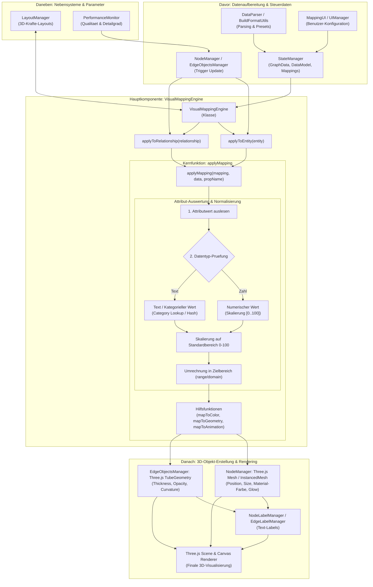

# Ablaufdiagramm: VisualMappingEngine & applyMapping

Dieses Dokument beschreibt den Daten- und Steuerungsfluss der `VisualMappingEngine` mit der zentralen Methode `applyMapping` sowie den davor, daneben und danach geschalteten Komponenten.

## Mermaid Flowchart

## Erlaeuterung der Abschnitte

1. **Davor**:
   - `DataParser` & `BuildFormatUtils`: Verarbeiten die Eingabedaten.
   - `StateManager`: Verwalter von Datenschema, Mappings und Einstellungen.
   - `MappingUI`: Die Benutzerschnittstelle im Mapping-Panel.
   - `NodeManager` / `EdgeObjectsManager`: Linsen den Render-Vorgang aus.

2. **Hauptkomponente (VisualMappingEngine & applyMapping)**:
   - `VisualMappingEngine`: Steuert die Anwendung aller Mappings.
   - `applyToEntity` / `applyToRelationship`: Wenden Presets auf einzelne Knoten/Kanten an.
   - `applyMapping`: Auswertung des Attributs. Rechnet sowohl numerische Werte als auch Text-Attribute in den Wertebereich `0..100` um und berechnet daraus den Zielparameter.

3. **Daneben**:
   - `LayoutManager`: Beruecksichtigt Mappings fuer Physik & Raumverteilung.
   - `PerformanceMonitor`: Steuert Skalierungsfaktoren und Detailstufen.

4. **Danach**:
   - `NodeManager` & `EdgeObjectsManager`: Wenden die berechneten Parameter auf Three.js Geometrien und Materialien an.
   - `NodeLabelManager` & `EdgeLabelManager`: Positionieren die Textbeschriftungen.
   - `Three.js Canvas Renderer`: Rendert das finale 3D-Ergebnis auf dem Bildschirm.
