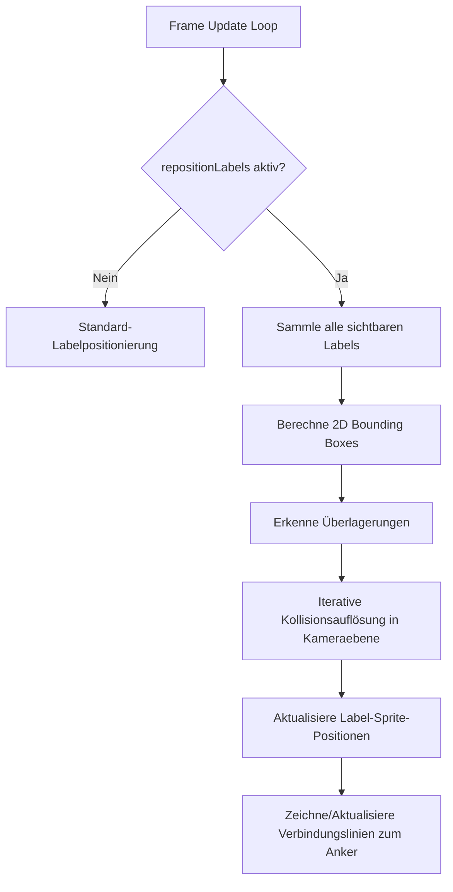

# Label-Repositionierung und Überlagerungsschutz (v0.102.12)

## 1. Zielsetzung
Implementierung einer dynamischen 2D/3D-Überlagerungserkennung und -Repositionierung für Knotens- und Kanten-Labels in Nodges. 
Wenn die Option im Tab "Ansicht" -> "Beschriftungen" aktiviert ist, prüft das System kontinuierlich die Bildschirmkoordinaten (Bounding Boxes) aller sichtbaren Labels auf Kollisionen/Überlagerungen. Bei einer Überlagerung werden die betroffenen Labels sanft verschoben, sodass sie sich nicht mehr verdecken. Zur eindeutigen Zuordnung wird eine feine Verbindungslinie (Leader Line) zwischen jedem repositionierten Label und seinem zugehörigen Knoten bzw. seiner Kante gezeichnet.

## 2. Architektur & Komponenten

### 2.1 State Management (`StateManager.ts` & `StateTypes.ts`)
- Neuer UI-State-Parameter: `repositionLabels: boolean` (Standard: `false`).
- Einordnung in `STATE_CATEGORIES.UI` für reaktive Synchronisation mit dem Interface.

### 2.2 UI Integration (`ViewPanel.ts`)
- Neue Checkbox "Überlagerung vermeiden" im Bereich "Beschriftungen" des Tabs "Ansicht".
- Dynamische Aktivierung/Deaktivierung des Repositionierungs-Algorithmus.

### 2.3 Überlagerungserkennung & Kollisionsauflösung (`NodeLabelManager.ts` & `EdgeLabelManager.ts`)
- **Projektion**: Umrechnung der 3D-Weltpositionen aller sichtbaren Labels in 2D-Bildschirm-Bounding-Boxes $(x_{min}, y_{min}, x_{max}, y_{max})$.
- **Kollisionsauflösung**: Iterativer Kraft- bzw. Entzerrungsalgorithmus in Kamera-Ebene (2D/3D-Verschiebung entlang der Kamera-Rechts- und Kamera-Hoch-Vektoren `cameraRight` & `cameraUp`).
- **Verbindungslinien (Leader Lines)**:
  - Einbindung einer `THREE.LineSegments`-Gruppe zur Performanten Darstellung aller aktiven Verbindungslinien in einem einzigen Render-Pass.
  - Dynamisches Update der Linienpunkte von der Ankerposition des KNOTENS/der KANTE bis zum Zentrum des verschobenen Labels.
  - Stylischer, dezent-transparenter Look im Nodges-Designsystem.

## 3. Ablaufdiagramm (Mermaid)

