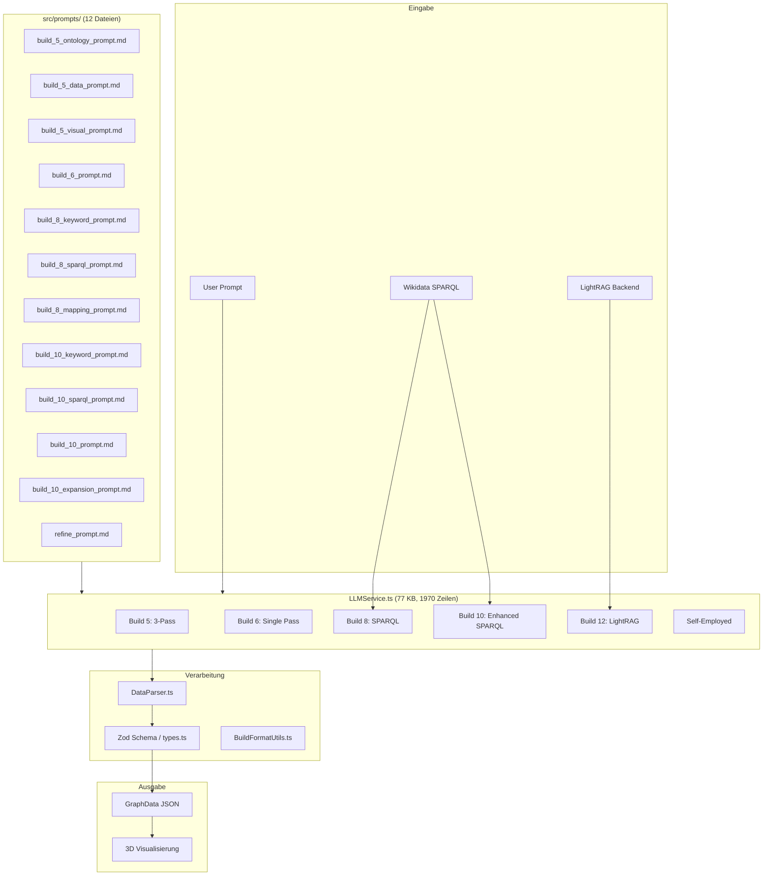
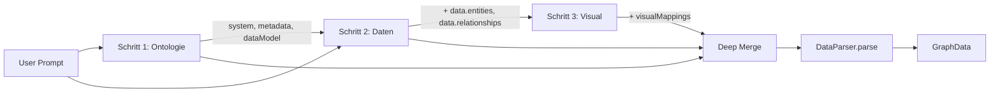
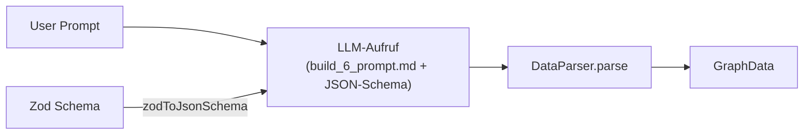
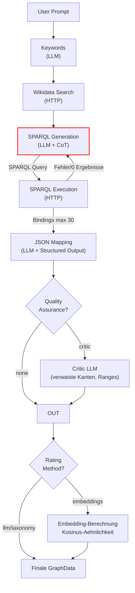
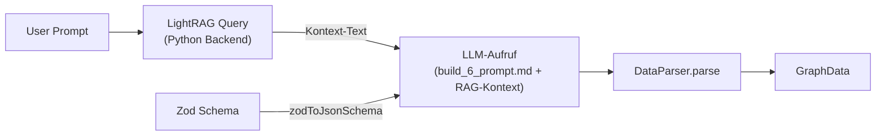
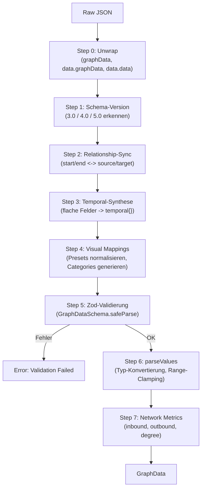

# Architektur-Analyse: JSON-Build-Prozesse in Nodges

> Version 0.102.14 -- Stand: 23. Juli 2026

---

## 1. Einleitung und Zielsetzung

Nodges erzeugt aus einem Benutzer-Prompt einen 3D-Wissensgraphen im JSON-Format. Dafuer stehen sechs verschiedene Build-Pipelines zur Verfuegung, die sich in Strategie, Datenquelle, Komplexitaet und Ergebnisqualitaet unterscheiden. Dieser Bericht analysiert die Architektur dieser Pipelines, bewertet ihren Aufbau und formuliert konkrete Verbesserungsvorschlaege.

**Ziel des Systems**: Reale Systeme korrekt als Wissensgraphen darzustellen. Das LLM (oder eine Datenquelle wie Wikidata/RAG) muss die wichtigsten Entitaeten und Relationen eines Prompts erfassen und strukturkonform ins JSON-Schema schreiben. Bei maximal 200 Nodes und Edges spielt Performance keine Rolle -- die primaere Herausforderung ist die *inhaltliche Korrektheit* und *strukturelle Validitaet* der Ausgabe.

---

## 2. System-Uebersicht

### 2.1 Beteiligte Komponenten



### 2.2 Build-Uebersicht

| Build | Name | Pipeline-Schritte | Datenquelle | LLM-Aufrufe | Prompt-Dateien | Structured Output |
|-------|------|-------------------|-------------|-------------|----------------|-------------------|
| **Build 5** | 3-Pass Pipeline | Ontologie -> Daten -> Visual | LLM-Wissen | 3 | 3 separate .md | Nein (json_object) |
| **Build 6** | Single Pass | Alles in einem | LLM-Wissen | 1 | 1 .md | Ja (json_schema) |
| **Build 8** | SPARQL Pipeline | Keywords -> Wikidata -> SPARQL -> Exec -> Mapping | Wikidata + LLM | 3 + 2 HTTP | 3 .md | Nein (json_object) |
| **Build 10** | Enhanced SPARQL | Wie B8 + Retry + Critic + Expansion | Wikidata + LLM | 3-6 + 2 HTTP | 4 .md + CoT | Ja (json_schema) |
| **Build 12** | LightRAG Pipeline | RAG Query -> Mapping | LightRAG + LLM | 1 + 1 RAG | Inline (nutzt build_6) | Ja (json_schema) |
| **Self-Employed** | Self-Employed | Generate | LLM + Zod-Schema | 1 | Kein .md | Nein (json_object) |

### 2.3 Unterstuetzte LLM-Provider

| Provider | API-Endpunkt | Default-Modell | Besonderheiten |
|----------|-------------|----------------|----------------|
| OpenRouter | `openrouter.ai/api/v1/chat/completions` | konfigurierbar | Structured Output, Deno-Proxy-Fallback |
| OpenAI | `api.openai.com/v1/chat/completions` | `gpt-4o-mini` | Structured Output |
| Anthropic | `api.anthropic.com/v1/messages` | konfigurierbar | Eigenes API-Format, kein json_schema-Modus |
| Ollama | `localhost:11434/v1/chat/completions` | konfigurierbar | Lokal, optionaler json_schema-Modus |
| LM Studio | `localhost:1234/v1/chat/completions` | konfigurierbar | Lokal, wie Ollama |

---

## 3. Das Datenmodell: Zod-Schema als Single Source of Truth

Die Datei [types.ts](file:///c:/Users/ich/Desktop/code/_projects/Nodges/src/types.ts) definiert das gesamte Datenmodell ueber Zod-Schemas. Das ist der architektonische Kern von Nodges.

### 3.1 GraphData-Struktur (Schema-Version 5.2)

```
GraphData
  +-- system: string               ("Name des Systems")
  +-- metadata
  |     +-- schemaVersion: "5.2"
  |     +-- description, author, created
  |     +-- competencyQuestions[]
  |     +-- map? (image, referenceWidth, referenceHeight)
  +-- dataModel?
  |     +-- properties: Record<string, PropertySchema>
  |           +-- type: continuous | categorical | vector | spatial | temporal | boolean | string | number | text
  |           +-- range?: [min, max]
  |           +-- unit?: string
  |           +-- values?: string[]    (fuer categorical)
  |           +-- dimensions?: string[] (fuer vector)
  |           +-- coordinates?: string[] (fuer spatial)
  +-- visualMappings?
  |     +-- defaultPresets: Record<string, EntityVisualPreset | RelationshipVisualPreset>
  |           +-- global_node: { size, color, geometry, glow, animation, positionX/Y/Z, ... }
  |           +-- global_edge: { thickness, color, curvature, opacity, animation_*, ... }
  +-- fields?: FieldData[]           (Kraftfelder fuer Physik-Simulation)
  +-- data
        +-- entities: EntityData[]
        |     +-- id, label, position?, mapX?, mapY?, temporal?, stateVector?, ...custom props
        +-- relationships: RelationshipData[]
              +-- id?, source, target, label, nodes?, temporal?, ...custom props
```

### 3.2 Dreifache Nutzung des Zod-Schemas

Das Zod-Schema wird auf drei Ebenen genutzt:

1. **Compile-Time**: TypeScript-Typen via `z.infer<typeof GraphDataSchema>` -- Typsicherheit im Code
2. **Runtime**: `GraphDataSchema.safeParse(data)` im DataParser -- Validierung eingehender Daten
3. **LLM-Steuerung**: `zodToJsonSchema(GraphDataSchema)` in Build 6/10/12 -- Structured Output fuer APIs

Das ist architektonisch vorbildlich, weil Aenderungen am Schema automatisch auf alle drei Ebenen wirken. Allerdings nur fuer Builds, die `zodToJsonSchema` nutzen (Build 6, 10, 12) -- die manuellen Prompt-Dateien (.md) sind davon entkoppelt.

### 3.3 Schema-Versionen und Rueckwaertskompatibilitaet

Der DataParser unterstuetzt drei Schema-Versionen:

| Version | Eigenschafts-Speicherung | Zugriff |
|---------|--------------------------|---------|
| **3.0** | `entity.stateVector.propName` | Verschachtelt im stateVector |
| **4.0** | `entity.stateVector.propName` + `dataModel.properties` (global) | stateVector mit globalem Schema |
| **5.0/5.2** | `entity.propName` direkt + `dataModel.properties` (typ-spezifisch) | Flach auf Entity-Ebene |

Die Abstraktion erfolgt in [BuildFormatUtils.ts](file:///c:/Users/ich/Desktop/code/_projects/Nodges/src/core/BuildFormatUtils.ts) ueber die Funktion `getEntityAttributeValue()`:

```typescript
// Erst Build 5 (direkt auf Entity):
if (attrName in entity && attrName !== 'stateVector') {
    return (entity as any)[attrName];
}
// Dann Build 3/4 Fallback (stateVector):
if (!entity.stateVector) return undefined;
let current: any = entity.stateVector;
// ... dot-notation Traversal
```

**Bewertung**: Die Rueckwaertskompatibilitaet ist gut geloest. Allerdings ist der Dateiname `BuildFormatUtils` irrefuehrend -- die Datei enthaelt Property-Zugriffs-Abstraktion fuer Schema-Versionen, keine Build-Pipeline-Konfigurationen.

---

## 4. Detailanalyse der einzelnen Builds

### 4.1 Build 5: 3-Pass Pipeline

#### Philosophie
Separation of Concerns: Jeder Aspekt (Ontologie, Daten, Visualisierung) wird isoliert in einem eigenen LLM-Aufruf behandelt. Das reduziert die kognitive Last pro Aufruf und erlaubt spezialisierte Prompts.

#### Datenfluss



#### Prompt-Analyse

**Schritt 1 -- Ontologie** ([build_5_ontology_prompt.md](file:///c:/Users/ich/Desktop/code/_projects/Nodges/src/prompts/build_5_ontology_prompt.md)):
- Erzeugt: `system`, `metadata` (inkl. 3-5 Competency Questions), `dataModel`
- Erzeugt NICHT: `data` (leere Arrays), `visualMappings`
- Besondere Regeln:
  - Nesting-Verbot (keine verschachtelten Objekte als Properties)
  - Abgrenzungsregel: Werte mit eigener Identitaet muessen Kanten sein
  - Gruppen als eigene Entitaeten mit `belongs_to`-Kanten
  - Verbotene Property-Typen: "string", "text", "number"

**Schritt 2 -- Daten** ([build_5_data_prompt.md](file:///c:/Users/ich/Desktop/code/_projects/Nodges/src/prompts/build_5_data_prompt.md)):
- Erhaelt Ontologie aus Schritt 1 als Kontext
- Strikte Schema-Bindung: Keine neuen Typen oder Attribute erfinden
- Null-Handling: Unbekannte Werte auf `null` setzen
- Temporal-Handling: `validFrom`/`validTo` + `history`-Array mit Delta-Regel
- Mindestumfang: 10-15 Entities, 15-25 Relationships

**Schritt 3 -- Visual** ([build_5_visual_prompt.md](file:///c:/Users/ich/Desktop/code/_projects/Nodges/src/prompts/build_5_visual_prompt.md)):
- Analysiert die tatsaechlichen Datenbereiche aus Schritt 2
- Globale Kanal-Eindeutigkeit: Ein visueller Kanal darf nur von einem Attribut gesteuert werden
- Nur `global_node` und `global_edge` in defaultPresets

#### Code-Ablauf im LLMService

```
generateGraphDataMultiStepBuild5():
  1. loadPrompt('build_5_ontology_prompt.md')
  2. _executeLLMCall(ontologyPrompt, userPrompt) -> step1Data
  3. loadPrompt('build_5_data_prompt.md')
  4. _executeLLMCall(dataPrompt, userPrompt + JSON.stringify(step1Data)) -> step2Data
  5. mergedData = { ...step1Data, ...step2Data }
  6. loadPrompt('build_5_visual_prompt.md')
  7. _executeLLMCall(visualPrompt, userPrompt + JSON.stringify(mergedData)) -> step3Data
  8. finalData = { ...mergedData, ...step3Data }
  9. return finalData
```

#### Bewertung

| Aspekt | Bewertung | Detail |
|--------|-----------|--------|
| Ergebnisqualitaet | Gut | Spezialisierte Prompts fuehren zu fokussierten Ergebnissen |
| Ontologie-Design | Sehr gut | Competency Questions erzwingen durchdachte Schemata |
| Visual Mappings | Sehr gut | Basieren auf echten Daten, nicht auf Schaetzungen |
| Kosten/Latenz | Maessig | 3 API-Aufrufe, jeder mit Schema-Overhead |
| Fehlerfortpflanzung | Schwach | Kein Abbruch/Korrektur bei fehlerhafter Ontologie |
| Zwischen-Validierung | Fehlend | Schritt 2 koennte Schema von Schritt 1 verletzen |

---

### 4.2 Build 6: Single Pass

#### Philosophie
Alles in einem einzigen LLM-Aufruf -- minimale Latenz, minimale Kosten. Nutzt Structured Outputs (striktes JSON-Schema) bei kompatiblen Providern (OpenRouter, OpenAI), um Schema-Konformitaet zu erzwingen.

#### Datenfluss



#### Prompt-Analyse

[build_6_prompt.md](file:///c:/Users/ich/Desktop/code/_projects/Nodges/src/prompts/build_6_prompt.md) fordert das LLM auf, "gedanklich in 3 Schritten vorzugehen" (Ontologie -> Daten -> Visual), aber alles in einem einzigen JSON auszugeben. Der Prompt enthaelt:

- Alle Regeln von Build 5 komprimiert in einem Prompt
- Zielstruktur-Beispiel als JSON-Block
- 17+ explizite Regeln (kein `type`-Feld, kein Nesting, Range-Einhaltung, etc.)

Zusaetzlich zum Prompt-Text wird das Zod-Schema via `_getStrictJsonSchema()` als Structured Output uebergeben:

```typescript
response_format: {
    type: 'json_schema',
    json_schema: {
        name: 'GraphDataSchema',
        strict: true,
        schema: jsonSchema  // aus zodToJsonSchema(GraphDataSchema)
    }
}
```

Die Funktion `_makeSchemaStrict()` bereitet das Schema auf:
- Entfernt `default`-Felder (nicht erlaubt im strict mode)
- Setzt `additionalProperties: false` fuer alle Objekte
- Macht alle Properties `required`
- Loest `$ref`-Referenzen rekursiv auf

#### Bewertung

| Aspekt | Bewertung | Detail |
|--------|-----------|--------|
| Ergebnisqualitaet | Gut (einfache Prompts), Maessig (komplexe Systeme) | Ein Aufruf muss alles richtig machen |
| Schema-Konformitaet | Sehr gut | Structured Output erzwingt Schema-Treue |
| Kosten/Latenz | Hervorragend | 1 API-Aufruf |
| Zentralitaet | Hoch | Default-Build und Fallback fuer alle anderen |
| Kognitive Last | Hoch | LLM muss Ontologie, Daten UND Visual gleichzeitig erzeugen |
| Visual Mappings | Maessig | Basieren auf geschaetzten, nicht auf echten Daten |

**Besondere Rolle**: Build 6 dient als universeller Fallback. Bei Fehlern in Build 8, 10 oder 12 wird automatisch auf Build 6 zurueckgefallen. Das macht Build 6 zum kritischsten Build im System.

---

### 4.3 Build 8: SPARQL Pipeline

#### Philosophie
Faktenbasierte Graphen aus Wikidata statt LLM-Halluzinationen. Die Pipeline extrahiert zuerst Suchbegriffe, findet Wikidata-IDs, generiert eine SPARQL-Abfrage, fuehrt sie aus und transformiert die Ergebnisse ins Nodges-Format.

#### Datenfluss

```mermaid
flowchart TD
    UP[User Prompt] --> K["Schritt 1: Keyword-Extraktion<br>(LLM)"]
    K -->|entities[], properties[]| WS["Schritt 2: Wikidata Search<br>(HTTP API)"]
    WS -->|Q-IDs, P-IDs| SG["Schritt 3: SPARQL-Generierung<br>(LLM)"]
    SG -->|SPARQL Query String| SE["Schritt 4: SPARQL Execution<br>(HTTP POST)"]
    SE -->|JSON Bindings| MAP["Schritt 5: Mapping<br>(LLM)"]
    MAP --> DP[DataParser.parse]
    DP --> GD[GraphData]

    style WS fill:#2d5016
    style SE fill:#2d5016
```

#### Prompt-Analyse

**Schritt 1** ([build_8_keyword_prompt.md](file:///c:/Users/ich/Desktop/code/_projects/Nodges/src/prompts/build_8_keyword_prompt.md)):
- Output: `{ "entities": ["keyword1", ...], "properties": ["keyword2", ...] }`
- Regeln: Englische Begriffe bevorzugen, autonome Expansion abstrakter Begriffe, generische Formulierungen

**Schritt 3** ([build_8_sparql_prompt.md](file:///c:/Users/ich/Desktop/code/_projects/Nodges/src/prompts/build_8_sparql_prompt.md)):
- Output: `{ "query": "SELECT ..." }`
- Spezifische SPARQL-Regeln: UNION-Syntax in eigenen Klammern, `SERVICE wikibase:label`, `wdt:P31/wdt:P279*` fuer Unterklassen, LIMIT 50-100, Timeout-Schutz (60s)
- Verbot von ID-Halluzinationen: Nur uebergebene Q-/P-IDs verwenden

**Schritt 5** ([build_8_mapping_prompt.md](file:///c:/Users/ich/Desktop/code/_projects/Nodges/src/prompts/build_8_mapping_prompt.md)):
- Input: Maximal 40 SPARQL-Bindings + User-Prompt
- Output: Vollstaendiges Nodges-JSON
- Q-IDs als Knoten-IDs, strikte referentielle Integritaet, Datentyp-Restriktionen

#### Wikidata-Integration im Code

Die Wikidata-Suche (Schritt 2) nutzt die `wbsearchentities`-API:

```
GET https://www.wikidata.org/w/api.php
  ?action=wbsearchentities
  &search={keyword}
  &language=en
  &type=item          // fuer Q-IDs
  &type=property      // fuer P-IDs
  &format=json
```

Die SPARQL-Ausfuehrung (Schritt 4) nutzt HTTP POST:

```
POST https://query.wikidata.org/sparql
Content-Type: application/x-www-form-urlencoded
Accept: application/sparql-results+json
User-Agent: Nodges/1.0

body: query={URL-encoded SPARQL}
```

#### Bewertung

| Aspekt | Bewertung | Detail |
|--------|-----------|--------|
| Faktentreue | Hoch | Daten direkt aus Wikidata |
| SPARQL-Zuverlaessigkeit | Schwach | LLM-generiertes SPARQL ist fehleranfaellig, KEINE Retry-Logik |
| Abdeckung | Variabel | Gut bei Personen/Geografie, schwach bei abstrakten Konzepten |
| Skalierung | Eingeschraenkt | Max. 40 Bindings = Informationsverlust |
| Kosten | Maessig | 3 LLM-Aufrufe + 2 HTTP-Requests |

---

### 4.4 Build 10: Enhanced SPARQL

#### Philosophie
Build 8 mit allen Verbesserungen: Retry-Logik, Chain-of-Thought, Critic-Pass, Embedding-Rating, modulare Konfiguration. Der ambitionierteste und robusteste Build.

#### Datenfluss



#### Modulare Konfiguration: Build10Config

```typescript
interface Build10Config {
    grounding: 'none' | 'wikidata' | 'rag' | 'dedup';
    qualityAssurance: 'none' | 'critic' | 'human';
    ratingMethod: 'llm' | 'taxonomy' | 'embeddings';
}
```

| Grounding | Beschreibung |
|-----------|-------------|
| `none` | Kein externes Grounding, nur LLM-Wissen |
| `wikidata` | Vollstaendige SPARQL-Pipeline (Keywords -> Search -> SPARQL -> Execute) |
| `rag` | LightRAG-Abfrage als Kontext |
| `dedup` | Semantische Deduplizierung via Embeddings |

| Quality Assurance | Beschreibung |
|-------------------|-------------|
| `none` | Keine Post-Validierung |
| `critic` | Zweiter LLM-Aufruf prueft verwaiste Kanten und Wertebereichsverletzungen |
| `human` | (Platzhalter fuer manuelle Pruefung) |

| Rating Method | Beschreibung |
|---------------|-------------|
| `llm` | LLM schaetzt `strength` (0-100) pro Beziehung |
| `taxonomy` | Feste Beziehungstypen (`influences`, `prevents`, `supports`, ...) mit `strength` 1-5 |
| `embeddings` | Kosinus-Aehnlichkeit der Entity-Labels als Kantenstaerke |

#### SPARQL-Retry-Logik (Alleinstellungsmerkmal gegenueber Build 8)

```typescript
let maxRetries = 2;
let attempt = 0;
while (attempt < maxRetries) {
    attempt++;
    // Generiere SPARQL (mit lastError als Feedback bei Retry)
    const sparqlContext = `...
    ${lastError ? `Previous attempt failed: ${lastError}\nPlease fix the query.` : ''}`;
    
    // Ausfuehren
    const response = await fetch(sparqlUrl, { method: 'POST', ... });
    if (!response.ok) { lastError = `HTTP ${response.status}: ...`; continue; }
    
    if (sparqlBindings.length === 0) { lastError = 'Query returned 0 results'; continue; }
    break; // Erfolg
}
```

Das ist der entscheidende Unterschied zu Build 8: Bei Fehlern wird die Fehlermeldung des Wikidata-Servers an den LLM-Prompt angehaengt, sodass das LLM seine Query selbst korrigieren kann.

#### Chain-of-Thought in SPARQL-Prompts

Build 10 fordert vom LLM einen `thought_process` im JSON:

```json
{
  "thought_process": "The user asks about the solar system. 
    Q328 is the solar system entity. P527 (has part) connects it to planets.
    I need to distinguish Q328 (individual) from 'planet' (class)...",
  "query": "SELECT DISTINCT ?item ?itemLabel ..."
}
```

Dieser CoT-Ansatz verbessert die SPARQL-Qualitaet nachweislich, weil das LLM die Beziehungsrichtung (P31 vs P279 vs P361) und die Unterscheidung Einzelobjekt vs. Klasse explizit durchdenken muss.

#### Embedding-basiertes Rating

Bei `ratingMethod: 'embeddings'`:

1. Fuer jede Entity wird ein Embedding via `generateEmbedding(entity.label)` erzeugt
2. Fuer jede Beziehung wird die Kosinus-Aehnlichkeit zwischen Source- und Target-Embedding berechnet
3. Der Wert wird als `rel.strength` injiziert
4. `visualMappings.defaultPresets.global_edge.thickness` wird auf diesen Wert gemappt

Unterstuetzte Embedding-Modelle:
- OpenRouter: `google/gemini-embedding-2`
- OpenAI: `text-embedding-3-small`
- Ollama: `nomic-embed-text`

#### Node Expansion / Deep Dive

```typescript
expandGraphNodeBuild10(nodeId, existingGraph):
  1. Wikidata Search API -> Q-ID fuer den Knoten
  2. LLM generiert SPARQL mit build_10_expansion_prompt.md
     (Meta-Pattern: wd:Q... ?p ?val . ?prop wikibase:directClaim ?p)
  3. SPARQL-Ausfuehrung mit Retry (max 100 Bindings)
  4. LLM transformiert Ergebnisse mit build_6_prompt.md + bestehendem dataModel
  5. Neue Entities/Relationships werden in den bestehenden Graph gemerged
```

Das Meta-Pattern `wd:Q... ?p ?val . ?prop wikibase:directClaim ?p` ist besonders elegant: Es ruft automatisch *alle* Properties eines Wikidata-Items ab, ohne sie einzeln auflisten zu muessen.

#### Bewertung

| Aspekt | Bewertung | Detail |
|--------|-----------|--------|
| Robustheit | Hervorragend | Retry-Logik, Critic-Pass, Fallbacks |
| Ergebnisqualitaet | Hoch | CoT + Structured Output + Grounding |
| Konfigurierbarkeit | Sehr gut | 3 unabhaengige Dimensionen |
| Komplexitaet | Sehr hoch | Schwer zu debuggen, viele Codepfade |
| Kosten | Hoch | 4-6 LLM-Aufrufe + HTTP-Requests + optional Embeddings |
| Wartbarkeit | Maessig | ~350 Zeilen fuer eine einzelne Methode |

---

### 4.5 Build 12: LightRAG Pipeline

#### Philosophie
Eigene, kontrollierte Wissensbasis statt Wikidata oder reines LLM-Wissen. Nutzt ein lokales Python-Backend mit LightRAG fuer Retrieval Augmented Generation.

#### Datenfluss



#### Code-Analyse

Build 12 ist architektonisch der einfachste Multi-Source-Build:

```typescript
// Schritt 1: RAG-Abfrage
const lightrag = new LightRAGService();
const ragResult = await lightrag.query(prompt, 'hybrid');
ragContext = ragResult.response;

// Schritt 2: Build 6 Prompt + RAG-Kontext
let systemPrompt = await _loadPrompt('build_6_prompt.md');
systemPrompt += `\n\n## Quelldaten aus der Wissensdatenbank:\n${ragContext}`;

// Structured Output wie Build 6
result = await _executeLLMCall(systemPrompt, prompt, provider, model, signal, {
    response_format: { type: 'json_schema', json_schema: { ... } }
});
```

#### Bewertung

| Aspekt | Bewertung | Detail |
|--------|-----------|--------|
| Domaenen-Flexibilitaet | Sehr gut | Eigene Dokumente als Wissensbasis |
| Unabhaengigkeit | Sehr gut | Kein externer API-Zugriff noetig |
| Architektonische Sauberkeit | Maessig | Kein eigener Prompt, haengt RAG-Kontext an Build-6-Prompt an |
| Wartbarkeit | Gut | Einfacher Code, wenige Schritte |
| RAG-Qualitaet | Variabel | Abhaengig von Dokumentenbasis und Chunk-Strategie |

**Kritik**: Build 12 hat keinen eigenen Prompt, sondern haengt den RAG-Kontext an `build_6_prompt.md` an. Das bedeutet:
- Die Build-6-Regeln (z.B. "erzeuge 10-20 Entities") gelten auch fuer RAG-Daten, obwohl die RAG-Ergebnisse moeglicherweise andere Mengenverhaeltnisse erfordern
- Keine spezifischen Anweisungen fuer den Umgang mit RAG-Kontexten (z.B. Quellenangaben, Unsicherheitsmarkierung)

---

### 4.6 Self-Employed

#### Philosophie
Minimaler Eingriff: Das LLM bekommt das Zod-Schema als JSON-Schema und einen minimalen Prompt. Die Idee ist, dass das Schema selbst ausreichend Struktur vorgibt.

#### Code

```typescript
const jsonSchema = this._getStrictJsonSchema();
const systemPrompt = `You are a knowledge graph generator. 
Generate a semantic graph in JSON format.
The JSON must conform EXACTLY to the following JSON Schema:
${JSON.stringify(jsonSchema, null, 2)}

Rules:
- Generate 10-20 entities and 15-30 relationships.
- Use realistic, diverse data.
- All entity IDs must be unique.
- All relationship source/target must reference existing entity IDs.
- Include meaningful visualMappings.
- Set metadata.schemaVersion to "5.2".
- Do NOT use "type" as a top-level entity field.
Return ONLY the JSON object.`;
```

#### Bewertung

| Aspekt | Bewertung | Detail |
|--------|-----------|--------|
| Wartungsaufwand | Null | Kein manueller Prompt noetig |
| Schema-Synchronitaet | Perfekt | Direkt aus Zod generiert |
| Ergebnisqualitaet | Schwach | Keine domaenenspezifische Anleitung |
| Ontologie-Design | Schwach | LLM ratet bei Competency Questions und Property-Typen |
| Visual Mappings | Schwach | Oft generisch oder fehlerhaft |

**Bewertung**: Self-Employed ist primaer ein Experiment/Benchmark, nicht fuer Produktionseinsatz gedacht. Es zeigt, wie weit Structured Output allein reicht -- und die Antwort ist: nicht weit genug fuer qualitativ hochwertige Wissensgraphen.

---

## 5. Der DataParser: Normalisierungsschicht

### 5.1 Verarbeitungspipeline

Der [DataParser](file:///c:/Users/ich/Desktop/code/_projects/Nodges/src/core/DataParser.ts) ist Build-agnostisch und verarbeitet jedes JSON nach dem gleichen Schema:



### 5.2 Besonders robuste Mechanismen

**Temporal-Synthese**: Der Parser erkennt 14 verschiedene flache Zeitfeld-Namen und konvertiert sie automatisch in das verschachtelte `temporal`-Objekt:

```
startYear, startTime, validFrom, start_date, date, year, founded, established, birth, born
endYear, endTime, validTo, end_date, death, died
```

**Visual-Mappings-Normalisierung**: Erkennt 11 verschiedene Alias-Namen fuer Presets:

```
Node-Aliase: default, main_view, node, default_node, nodes -> global_node
Edge-Aliase: edge, default_edge, edges, link, links    -> global_edge
```

**Automatische Kategorie-Generierung**: Wenn ein `categorical` Mapping keine `params.categories` hat, scannt der Parser die tatsaechlichen Daten und generiert die Kategorie-zu-Farbe-Zuordnung automatisch mit einer 15-Farben-Palette.

**Netzwerkmetriken**: Nach dem Parsing werden `inbound`, `outbound` und `degree` fuer jede Entity berechnet und als Properties injiziert. Diese stehen dann fuer Visual Mappings zur Verfuegung (z.B. Knotengroesse proportional zum Grad).

### 5.3 Bewertung des DataParsers

| Aspekt | Bewertung |
|--------|-----------|
| Defensivitaet | Hervorragend -- korrigiert viele typische LLM-Fehler automatisch |
| Build-Agnostik | Vorbildlich -- einheitliche Verarbeitung unabhaengig vom Build |
| Rueckwaertskompatibilitaet | Gut -- 3 Schema-Versionen werden unterstuetzt |
| Fehlermeldungen | Gut -- detaillierte Zod-Error-Pfade |
| Erweiterbarkeit | Gut -- neue Transformationsschritte leicht hinzufuegbar |
| Semantische Pruefung | Fehlend -- nur Struktur, keine Inhaltsvalidierung |

---

## 6. JSON-Extraktion und Fehlerbehandlung

### 6.1 Die `_executeLLMCall`-Methode

Die zentrale Methode fuer alle LLM-Aufrufe (Zeilen 272-611 in LLMService.ts) enthaelt eine mehrschichtige Fehlerbehandlung:

**Schicht 1: HTTP-Level**
- Statuscodes pruefen (429 = Rate Limit, 400 = Bad Request)
- AbortError abfangen (Timeout)
- Provider-spezifische Fehlerbehandlung

**Schicht 2: JSON-Extraktion**

```typescript
// 1. Markdown-Fences entfernen
const mdMatch = cleanResponse.match(/```(?:json)?\s*([\s\S]*?)\s*```/i);

// 2. Brace-Matching-Fallback (wenn kein Markdown)
const firstBrace = cleanResponse.indexOf('{');
// ... Tiefenzaehlung fuer korrekte Klammerpaarung

// 3. JSON.parse mit Debug-File bei Fehler
try { parsedData = JSON.parse(cleanResponse); }
catch { _saveDebugFile(`LLM_ERROR_RAW_${Date.now()}.txt`, responseText); throw; }

// 4. Schema-Wrapper entpacken
if (parsedData?.GraphDataSchema) parsedData = parsedData.GraphDataSchema;
```

**Schicht 3: Struktur-Validierung**
Prueft, ob mindestens eines der erwarteten Felder existiert: `data.entities`, `data.relationships`, `dataModel`, `visualMappings`, `query`, `entities`, `properties`, `question`. Bei Fehlen wird eine Debug-Datei gespeichert.

**Schicht 4: Pflichtfelder sicherstellen**

```typescript
if (!parsedData.data) parsedData.data = {};
if (!parsedData.data.entities) parsedData.data.entities = [];
if (!parsedData.data.relationships) parsedData.data.relationships = [];
```

**Schicht 5: API-Metadaten injizieren**
Token-Verbrauch, Modell-Info und Fingerprint werden in `metadata.apiResponse` gespeichert.

### 6.2 OpenRouter-spezifische Fallbacks

```
Versuch 1: Structured Output (json_schema, strict: true)
  -> Bei leerem Ergebnis:
Versuch 2: json_object Modus
  -> Bei 400 Bad Request:
Versuch 3: Single-Message (System + User in einem Block)
```

### 6.3 Bewertung der Fehlerbehandlung

| Aspekt | Bewertung |
|--------|-----------|
| JSON-Extraktion | Sehr gut -- Markdown, Brace-Matching, Schema-Wrapper |
| Debug-Sicherung | Vorbildlich -- fehlgeschlagene Antworten werden persistiert |
| Provider-Fallbacks | Gut -- OpenRouter hat mehrere Fallback-Stufen |
| Retry-Logik | Schwach -- nur auf SPARQL-Ebene (Build 10), nicht auf LLM-Ebene |
| Token-Tracking | Vorhanden -- aber kein Budget-Management |

---

## 7. Scripts und Tooling

### 7.1 Uebersicht

| Script | Zweck | LLM? | Format |
|--------|-------|------|--------|
| [generate_json.cjs](file:///c:/Users/ich/Desktop/code/_projects/Nodges/scripts/generate_json.cjs) | Statische Architektur-JSONs erzeugen | Nein | V1.0 |
| [generate_examples.mjs](file:///c:/Users/ich/Desktop/code/_projects/Nodges/scripts/generate_examples.mjs) | Synthetische Testdaten (Temporal, Maps, Stress) | Nein | V3.0 |
| [run_testreihe.mjs](file:///c:/Users/ich/Desktop/code/_projects/Nodges/scripts/run_testreihe.mjs) | LLM-Benchmark (mehrere Modelle, Build 5) | Ja | V5.x |
| [generate_test_graph.cjs](file:///c:/Users/ich/Desktop/code/_projects/Nodges/scripts/generate_test_graph.cjs) | Zufaellige Stresstest-Graphen | Nein | V2.0 |
| [convert_csv.cjs](file:///c:/Users/ich/Desktop/code/_projects/Nodges/scripts/convert_csv.cjs) | CSV-zu-Nodges-Konvertierung | Nein | V1.0 |

### 7.2 Kritische Beobachtungen

**Code-Duplizierung**: `generate_json.cjs` enthaelt eine eigene Schema-Beschreibung als Freitext, die nicht mit dem Zod-Schema synchronisiert ist. Das ist eine Fehlerquelle.

**Technologie-Mix**: `.cjs` (CommonJS/require) und `.mjs` (ES Modules/import) werden gemischt. Die aelteren `.cjs`-Scripts koennen den `LLMService` nicht importieren.

**Fehlende CI-Integration**: Nur `gen:data` existiert als npm-Script. Die Testreihe (`run_testreihe.mjs`) wird manuell ausgefuehrt.

**Scoring-Luecke**: `run_testreihe.mjs` hat ein rudimentaeres Scoring (Hat es Entities? Stimmt das Schema?), aber keine semantische Pruefung (Sind die Entities relevant? Ist der Graph vollstaendig?).

---

## 8. Prompt-Architektur: Analyse und Kritik

### 8.1 Prompt-Duplizierung

Die folgende Tabelle zeigt, welche Regeln in welchen Prompts vorkommen:

| Regel | B5-Onto | B5-Data | B5-Vis | B6 | B8-KW | B8-SPARQL | B8-Map | B10-KW | B10-SPARQL | B10-Map | B10-Exp | Refine |
|-------|---------|---------|--------|-----|-------|-----------|--------|--------|------------|---------|---------|--------|
| Kein `type`-Feld | x | | | x | | | x | | | x | | |
| Kein Nesting | x | | | x | | | | | | x | | |
| Property-Typen | x | x | | x | | | x | | | x | | x |
| Zielstruktur JSON | x | | | x | | | x | | | x | | |
| Visual Mapping Regeln | | | x | x | | | x | | | x | | |
| Competency Questions | x | | | x | | | | | | x | | |
| Range-Einhaltung | | x | | x | | | x | | | x | | x |
| Temporal-Handling | | x | | x | | | | | | x | | x |
| Schema-Version 5.2 | x | | | x | | | x | | | x | | |

**Ergebnis**: Die gleichen Regeln werden in 4-8 Prompts wiederholt. Bei einer Schema-Aenderung muessen bis zu 8 Dateien manuell aktualisiert werden.

### 8.2 Prompt-Groessen

| Prompt | Bytes | Geschaetzte Tokens |
|--------|-------|--------------------|
| build_5_ontology_prompt.md | 5.066 | ~1.300 |
| build_5_data_prompt.md | 4.123 | ~1.000 |
| build_5_visual_prompt.md | 3.459 | ~900 |
| build_6_prompt.md | 5.015 | ~1.300 |
| build_8_keyword_prompt.md | 1.192 | ~300 |
| build_8_sparql_prompt.md | 2.371 | ~600 |
| build_8_mapping_prompt.md | 3.205 | ~800 |
| build_10_keyword_prompt.md | 1.454 | ~400 |
| build_10_sparql_prompt.md | 2.589 | ~650 |
| build_10_prompt.md | 5.066 | ~1.300 |
| build_10_expansion_prompt.md | 2.196 | ~550 |
| refine_prompt.md | 4.123 | ~1.000 |

**Summe**: ~40.000 Bytes, ~10.000 Tokens an Prompt-Texten. Davon sind schaetzungsweise 40% redundant (Schema-Beschreibungen, Zielstruktur-Beispiele, Property-Typ-Definitionen).

### 8.3 Kopierte Prompts

- `refine_prompt.md` ist eine 1:1 Kopie von `build_5_data_prompt.md`
- `build_10_keyword_prompt.md` ist eine leichte Erweiterung von `build_8_keyword_prompt.md`
- `build_10_prompt.md` ist eine leichte Erweiterung von `build_6_prompt.md`

---

## 9. Gesamtbewertung

### 9.1 Bewertungsmatrix

| Aspekt | Bewertung | Begruendung |
|--------|-----------|-------------|
| **Schema-Design (Zod)** | Hervorragend | Single Source of Truth, dreifache Nutzung, flexible Typen |
| **Parser-Robustheit** | Hervorragend | Defensiv, Build-agnostisch, 14+ Temporal-Aliase, Preset-Normalisierung |
| **Build-Vielfalt** | Sehr gut | Sechs Builds decken verschiedene Anwendungsfaelle ab |
| **Prompt-Engineering** | Gut bis sehr gut | CoT, Negativ-Regeln, SPARQL-Fallstricke -- aber zu viel Duplizierung |
| **Fehlerbehandlung** | Gut | JSON-Extraktion, Debug-Files, Fallback-Ketten |
| **Architektonische Sauberkeit** | Maessig | LLMService als God Class, Namensverwechslung, inkonsistente Script-Formate |
| **Wartbarkeit** | Maessig | Schema-Aenderungen erfordern manuelle Updates in 12 Prompt-Dateien |
| **Erweiterbarkeit** | Maessig | Neue Builds moeglich, aber ohne einheitliche Pipeline-Engine |
| **Semantische Validierung** | Schwach | Nur Struktur, keine Inhaltspruefung |
| **Testabdeckung** | Maessig | DataParser-Tests vorhanden, aber kein systematisches LLM-Output-Testing |

### 9.2 Staerken

1. **Zod als architektonischer Kern** -- Schema-Aenderungen wirken automatisch auf Typen, Validierung und Structured Output
2. **DataParser als Sicherheitsnetz** -- korrigiert viele typische LLM-Fehler automatisch
3. **Progressive Build-Komplexitaet** -- vom einfachen Self-Employed bis zum robusten Build 10
4. **Fallback-Ketten** -- jeder Build faellt bei Fehlern auf Build 6 zurueck
5. **Build 10 als Qualitaetsreferenz** -- CoT, Retry, Critic, Embeddings sind beeindruckend

### 9.3 Schwaechen

1. **Prompt-Duplizierung** -- 40% redundanter Text ueber 12 Dateien
2. **Monolithischer LLMService** -- 77 KB God Class mit 6 Pipelines, 5 Providern, JSON-Extraktion, Schema-Konvertierung
3. **Fehlende Zwischen-Validierung** -- Multi-Step-Pipelines validieren nicht zwischen den Schritten
4. **Keine semantische Pruefung** -- Struktur ja, Inhalt nein
5. **BuildFormatUtils Irrefuehrung** -- Name suggeriert Pipeline-Konfiguration, enthaelt Property-Zugriffs-Abstraktion

---

## 10. Verbesserungsvorschlaege

### 10.1 Prompt-Template-System

**Problem**: Schema-Beschreibungen werden in 12 Prompt-Dateien manuell wiederholt.

**Loesung**: Ein Template-System mit Platzhaltern, die zur Laufzeit ersetzt werden:

```markdown
# Prompt Template
Du bist ein Experte fuer Ontologie-Design.

{SCHEMA_REFERENCE}    <- aus zodToJsonSchema() generiert + semantische Annotationen
{GROUNDING_CONTEXT}   <- Wikidata/RAG-Ergebnisse (falls vorhanden)
{PREVIOUS_RESULT}     <- Vorheriges Pipeline-Ergebnis (fuer Multi-Step)
{BUILD_SPECIFIC_RULES} <- Build-spezifische Regeln

## Aufgabe:
{USER_PROMPT}
```

Die Schema-Referenz wird einmal generiert und in alle Prompts injiziert. Aenderungen am Zod-Schema wirken automatisch auf alle Prompts.

### 10.2 Einheitliche Pipeline-Engine

**Problem**: 6 separate Methoden mit jeweils eigener Pipeline-Logik.

**Loesung**: Eine konfigurationsgetriebene Pipeline-Engine:

```typescript
interface PipelineStep {
    name: string;
    prompt: string | PromptTemplate;
    inputValidator?: z.ZodSchema;
    outputValidator?: z.ZodSchema;
    retryPolicy?: { maxRetries: number; feedbackLoop: boolean };
    transform?: (input: any, llmOutput: any) => any;
    fallback?: PipelineStep;
    skipCondition?: (context: PipelineContext) => boolean;
}

// Build 6 als Konfiguration:
const build6: PipelineStep[] = [
    { name: 'complete', prompt: build6Template, outputValidator: GraphDataSchema }
];

// Build 10 als Konfiguration:
const build10: PipelineStep[] = [
    { name: 'keywords', prompt: keywordTemplate, outputValidator: KeywordsSchema },
    { name: 'wikidata_search', transform: wikidataSearch, skipCondition: noGrounding },
    { name: 'sparql', prompt: sparqlTemplate, retryPolicy: { maxRetries: 2, feedbackLoop: true } },
    { name: 'sparql_exec', transform: executeSparql },
    { name: 'mapping', prompt: mappingTemplate, outputValidator: GraphDataSchema },
    { name: 'critic', prompt: criticTemplate, skipCondition: noQA },
];
```

**Vorteile**: Neue Builds durch Konfiguration statt Code, einheitliches Logging/Monitoring, wiederverwendbare Steps.

### 10.3 Zwischen-Validierung in Multi-Step-Pipelines

**Problem**: Schritt 2 koennte gegen das Schema von Schritt 1 verstossen, ohne dass es bemerkt wird.

**Loesung**: Nach jedem Pipeline-Schritt eine leichtgewichtige Validierung:

| Nach Schritt | Validierung |
|-------------|-------------|
| Ontologie | Zod-Check gegen DataModelSchema. Pruefung: Ist mindestens 1 Entity-Typ und 1 Relationship-Typ definiert? |
| Daten | Verwenden alle Entities definierte Typen? Referenzieren alle Relationships existierende Entities? |
| Visual | Referenzieren alle Mappings existierende Properties? Sind Ranges sinnvoll? |
| SPARQL | Syntaxcheck (Klammerbalancierung, SELECT-Felder vorhanden) |

### 10.4 Semantisches Scoring

**Problem**: Keine Pruefung, ob der generierte Graph den Prompt inhaltlich korrekt abbildet.

**Loesung**: Ein automatisches Scoring nach der Generierung:

| Kriterium | Methode | Gewicht |
|-----------|---------|---------|
| **Vollstaendigkeit** | Alle Substantive des Prompts als Entities oder Properties repraesentiert? (Embeddings-Vergleich Prompt-Tokens vs. Entity-Labels) | 30% |
| **Konnektivitaet** | Isolierte Knoten? Zusammenhaengender Graph? (Graphalgorithmus) | 20% |
| **Referentielle Integritaet** | Verwaiste Kanten? (Bereits im DataParser, aber als Score) | 15% |
| **Diversitaet** | Werden alle definierten Typen genutzt? Min. 2 verschiedene Entity-Typen? | 15% |
| **Schema-Konformitaet** | Werte innerhalb Ranges? Alle Pflichtfelder vorhanden? | 10% |
| **Redundanz** | Doppelte Entities oder triviale Beziehungen? | 10% |

Das Scoring laeuft als Post-Processing-Schritt und generiert Warnungen (nicht blockierend). Bei einem Score unter einem Schwellwert koennte ein automatischer Retry ausgeloest werden.

### 10.5 Hybrid-Grounding

**Problem**: Datenquellen (LLM, Wikidata, RAG) werden alternativ, nicht kombiniert genutzt.

**Loesung**: Kaskadierendes Grounding:

```
1. Wikidata fuer strukturierte Fakten (Entitaeten, Taxonomien, numerische Daten)
2. LightRAG fuer domaenenspezifisches Wissen (eigene Dokumente)
3. LLM-Wissen als Lueckenfueller (nur wo 1+2 keine Ergebnisse liefern)
4. Kennzeichnung der Quelle pro Entity (wikidata | rag | llm | unknown)
```

### 10.6 Few-Shot statt Long-Schema

**Problem**: 5.000+ Bytes Schema-Beschreibung in jedem Prompt.

**Loesung**: Ein annotiertes Beispiel-JSON als Few-Shot-Beispiel:

```json
{
  "_kommentar": "Dieses Beispiel zeigt die korrekte Struktur",
  "system": "Beispiel-System",
  "metadata": { "schemaVersion": "5.2", "competencyQuestions": ["Was sind die Hauptkomponenten?"] },
  "dataModel": {
    "properties": {
      "einfluss": { "type": "continuous", "range": [0, 100], "_kommentar": "Numerischer Wert, wird auf size gemappt" },
      "kategorie": { "type": "categorical", "values": ["A", "B"], "_kommentar": "Wird auf color gemappt" }
    }
  },
  "data": {
    "entities": [
      { "id": "e1", "label": "Entitaet 1", "einfluss": 75, "kategorie": "A", "_kommentar": "Kein type-Feld!" }
    ],
    "relationships": [
      { "source": "e1", "target": "e2", "label": "beeinflusst", "_kommentar": "source/target muessen existieren" }
    ]
  }
}
```

Bei max. 200 Nodes ist ein vollstaendiges Beispiel mit ~20 Entities klein genug fuer den Prompt-Kontext.

### 10.7 LLMService Aufspaltung

**Problem**: 77 KB God Class.

**Moegliche Aufteilung**:

| Modul | Verantwortung | Geschaetzte Groesse |
|-------|---------------|---------------------|
| `LLMProviderAdapter.ts` | Provider-Abstraktion (fetch, Auth, Response-Parsing) | ~15 KB |
| `PipelineEngine.ts` | Pipeline-Orchestrierung, Step-Management, Progress | ~10 KB |
| `PromptManager.ts` | Prompt-Loading, Template-Rendering, Schema-Injektion | ~5 KB |
| `JsonExtractor.ts` | Markdown-Bereinigung, Brace-Matching, Wrapper-Entpackung | ~5 KB |
| `WikidataClient.ts` | Wikidata Search + SPARQL Execution | ~8 KB |
| `EmbeddingService.ts` | Embedding-Generierung und Kosinus-Aehnlichkeit | ~5 KB |
| `BuildConfigurations.ts` | Build-Definitionen als Pipeline-Konfigurationen | ~10 KB |

---

## 11. Fazit

Die Architektur der JSON-Build-Prozesse in Nodges ist in ihren Kernkomponenten (Zod-Schema, DataParser) sehr gut durchdacht. Die sechs Builds decken ein breites Spektrum von Anwendungsfaellen ab -- vom schnellen Single-Pass bis zum faktenbasierten SPARQL-Pipeline mit Qualitaetssicherung.

Die groessten Verbesserungshebel liegen nicht in neuen Features, sondern in **Konsolidierung und Systematisierung**:

1. **Prompt-Template-System** eliminiert 40% redundanten Prompt-Text und loest das Synchronisationsproblem
2. **Einheitliche Pipeline-Engine** reduziert den LLMService von 1970 auf ~700 Zeilen und macht Builds konfigurierbar statt hartcodiert
3. **Semantisches Scoring** schliesst die Luecke zwischen struktureller und inhaltlicher Validierung
4. **Zwischen-Validierung** verhindert Fehlerfortpflanzung in Multi-Step-Pipelines

Bei maximal 200 Nodes/Edges ist Performance irrelevant. Die einzige relevante Metrik ist die **Qualitaet der LLM-Ausgabe** -- und diese wird am effektivsten durch besseres Prompt-Engineering (Few-Shot, zentrale Schema-Referenz) und systematische Validierung (semantisches Scoring, Zwischen-Checks) verbessert.
