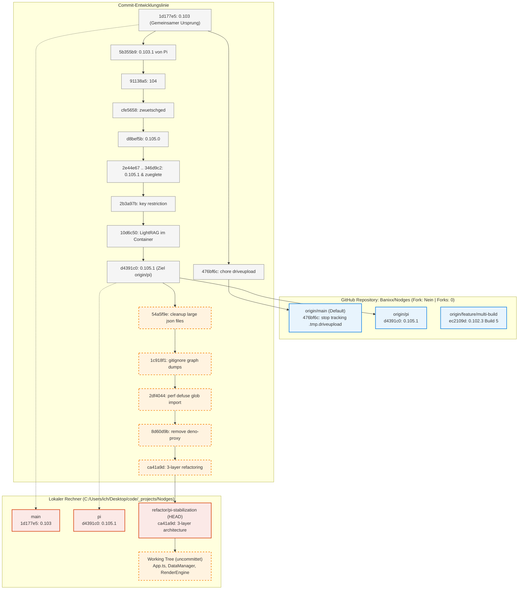

# Git- und Repository-Status: Banixx/Nodges

Dokumentation des aktuellen Git-Zustands, der Repository-Eigenschaften auf GitHub, der Branch-Struktur und der Commit-Historie.

## 1. Uebersicht des GitHub-Accounts & Repository

- **GitHub-Konto**: `Banixx` (URL: `https://github.com/Banixx`)
- **Repository-Name**: `Nodges`
- **Vollstaendiger Pfad**: `https://github.com/Banixx/Nodges`
- **Fork-Eigenschaft**:
  - `fork: false` (Das Repository ist **kein Fork**, sondern das eigenstaendige Original-Repository).
  - `forks_count: 0` (Es existieren aktuell **0 Forks** durch andere GitHub-Nutzer).
- **Default-Branch auf GitHub**: `main`
- **GitHub Pages**: Aktiviert auf `https://banixx.github.io/Nodges/` (Quelle: `main`-Branch).
- **Pull Requests / Issues**: Keine offenen PRs oder Issues. Historischer PR #1 (*Feature/multi build*) wurde am 29. Juni 2026 gemergt und geschlossen.

---

## 2. Remote- und Lokale Branches im Detail

### A. Remote-Branches auf GitHub (`origin`)
1. **`origin/main`** (Standard-Branch auf GitHub):
   - Letzter Commit: `476bf6c` (*chore: stop tracking .tmp.driveupload and add to gitignore*, 2026-09-22).
   - Basis: Version `0.103` (`1d177e5`, 2026-07-30).
   - **Wichtige Feststellung**: Dieser Branch enthaelt **keine** der Entwicklungen aus Version 0.103.1 bis 0.105.1.
2. **`origin/pi`**:
   - Letzter Commit: `d4391c0` (*0.105.1*, 2026-09-22).
   - Enthaelt den gesamten Entwicklungsstrang der Versionen 0.103.1 bis 0.105.1 (Container-Setup, Pi-Architektur, Minimap, CreatePanel, LightRAG-Integration).
3. **`origin/feature/multi-build`**:
   - Letzter Commit: `ec2109d` (*0.102.3 Build 5*). Historischer Stand.

### B. Lokale Branches auf dem Rechner
1. **`refactor/pi-stabilization`** (Aktuell aktiv / ausgecheckt als HEAD):
   - Basis: `origin/pi` auf Stand `d4391c0`.
   - Enthaelt **5 neue lokale Commits**, die noch **nicht** auf GitHub gepusht wurden:
     - `54a5f9e` (*cleanup: remove large generated json files and error dumps from public data*)
     - `1c918f1` (*chore: add generated graph data and temporary dumps to .gitignore*)
     - `2df4044` (*perf: defuse glob import in FilePanelUI and load small default graph on app start*)
     - `8d60d9b` (*cleanup: remove unused deno-proxy and legacy layout-worker.js*)
     - `ca41a9d` (*refactor: extract DataManager and RenderEngine from App.ts into 3-layer architecture*)
   - Lokaler Zustand: Uncommittete Aenderungen in `src/App.ts` und neue Dateien `src/core/DataManager.ts`, `src/core/RenderEngine.ts`.
2. **`pi`**:
   - Synchron mit `origin/pi` auf Stand `d4391c0`.
3. **`main`**:
   - Stand `1d177e5` (Version 0.103). Hinkt `origin/main` um 1 Commit (`476bf6c`) hinterher.
4. **`feature/multi-build`**:
   - Stand `ec2109d` (synchron mit `origin/feature/multi-build`).
5. **`fix-math-calculation-logic-20260712`**:
   - Lokaler Worktree-Branch auf Stand `5238ba8` (Version 0.102.7).
6. **`VersionA` / `VersionB`**:
   - Lokale Archivstaende auf Version 0.98.1.10.

---

## 3. Grafische Visualisierung der Commit- und Branch-Struktur

---

## 4. Kernpunkte und Divergenzen

1. **Kein Fork vorhanden**:
   - Ihr GitHub-Projekt `Nodges` ist ein eigenstaendiges Root-Repository und hat weder ein Upstream-Parent noch fremde Forks.
2. **Kluft zwischen `main` und `pi`**:
   - Auf GitHub steht der Standard-Branch `main` bei Version `0.103` (Ende Juli 2026).
   - Die Weiterentwicklung auf Version `0.105.1` lief vollstaendig auf dem Branch `pi`. Da `pi` bisher nicht in `main` zusammengefuehrt wurde, sieht die GitHub-Standardansicht (und damit auch GitHub Pages) nur den Stand von Version 0.103.
3. **Lokaler Refactoring-Ast (`refactor/pi-stabilization`)**:
   - Die fuenf juengsten Commits zur Code-Bereinigung und 3-Schichten-Architektur existieren aktuell ausschliesslich auf Ihrer lokalen Festplatte und sind noch nicht auf GitHub gesichert.
