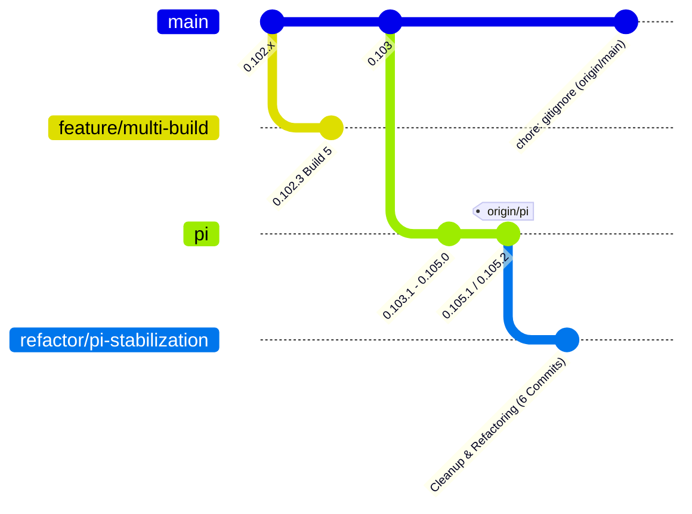
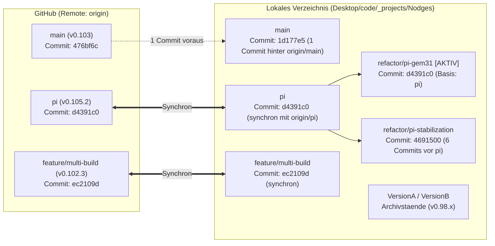

# Zusammenhaenge zwischen lokalem Repository und GitHub

Dieses Dokument erklaert die Verbindung zwischen dem lokalen Arbeitsverzeichnis und dem GitHub-Repository [https://github.com/Banixx/Nodges](https://github.com/Banixx/Nodges) sowie die verschiedenen Branches auf GitHub und lokal.

---

## 1. Grundprinzip: Lokales Verzeichnis vs. GitHub

Das lokale Verzeichnis [C:/Users/ich/Desktop/code/_projects/Nodges](file:///C:/Users/ich/Desktop/code/_projects/Nodges) ist ein eigenstaendiges Git-Repository mit eigener Historie und Datenbank im versteckten Ordner `.git`. 

GitHub dient als zentraler Server (Remote). In der lokalen Git-Konfiguration ist dieses GitHub-Repo unter dem Standardnamen `origin` hinterlegt:
- **Fetch-URL**: `https://github.com/Banixx/Nodges.git`
- **Push-URL**: `https://github.com/Banixx/Nodges.git`

Lokale Commits bleiben so lange ausschliesslich auf der Festplatte Ihres Rechners, bis sie mit `git push` zu GitHub uebertragen werden. Umgekehrt gelangen Aenderungen von GitHub erst ueber `git fetch` bzw. `git pull` in das lokale Repository.

---

## 2. Die Branches auf GitHub (origin)

Auf GitHub ([https://github.com/Banixx/Nodges](https://github.com/Banixx/Nodges)) existieren aktuell genau drei Branches:

### 1. `main` (Default Branch auf GitHub)
- **Letzter Commit**: `476bf6c` (*chore: stop tracking .tmp.driveupload and add to gitignore*)
- **Softwarestand**: Version 0.103
- **Rolle**: Dies ist der primaere Standard-Branch des Repositories auf GitHub. Er speist traditionell Builds und Bereitstellungen (z.B. GitHub Pages). Entwicklungen nach Version 0.103 wurden nicht direkt auf `main` weitergefuehrt, sondern auf den Branch `pi` verlagert.

### 2. `pi` (Aktiver Entwicklungszweig des Pi-Agenten / DevContainers)
- **Letzter Commit**: `d4391c0` (*0.105.1*, Versionsstand im Code ist `0.105.2`)
- **Softwarestand**: Version 0.105.2
- **Rolle**: Dieser Zweig repraesentiert den gesamten Entwicklungsfortschritt von Version 0.103.1 bis 0.105.1/0.105.2. Hier wurden die Container-Infrastruktur (DevContainer, Docker Compose fuer Pi), die LightRAG-Backend-Integration und wesentliche UI-Erweiterungen (CreatePanel, Minimap, Relation-Sets) implementiert.

### 3. `feature/multi-build` (Historischer Feature-Zweig)
- **Letzter Commit**: `ec2109d` (*0.102.3 Build 5*)
- **Softwarestand**: Version 0.102.3
- **Rolle**: Ein aelterer Feature-Branch fuer Multi-Build-Pipelines, der urspruenglich im Juni 2026 ueber Pull Request #1 in die fruehere Codebasis integriert wurde und als Referenz auf GitHub verblieben ist.

---

## 3. Vergleich: Lokale Branches vs. GitHub Branches

Lokal auf Ihrem Rechner befinden sich zusaetzliche Arbeits- und Archivzweige, die nicht auf GitHub hochgeladen wurden:

| Branch | Existiert auf GitHub? | Lokaler Commit | GitHub Commit (`origin`) | Status & Verhaeltnis |
|---|---|---|---|---|
| `refactor/pi-gem31` (aktiv) | Nein (nur lokal) | `d4391c0` | - | Aktueller lokaler Branch, basiert auf Stand `pi` (`d4391c0`). |
| `refactor/pi-stabilization` | Nein (nur lokal) | `4691500` | - | Lokaler Refactoring-Zweig, 6 Commits vor Stand `pi`. |
| `pi` | Ja | `d4391c0` | `d4391c0` | Vollstaendig synchron mit `origin/pi`. |
| `main` | Ja | `1d177e5` | `476bf6c` | Lokal hinkt 1 Commit hinterher (`origin/main` hat Gitignore-Fix). |
| `feature/multi-build` | Ja | `ec2109d` | `ec2109d` | Vollstaendig synchron mit `origin/feature/multi-build`. |
| `fix-math-calculation-logic-20260712` | Nein (nur lokal) | `5238ba8` | - | Alter Agenten-Fix-Zweig (v0.102.7), Worktree verwaist. |
| `VersionA` | Nein (nur lokal) | `b962818` | - | Lokaler Archiv-Stand frueherer Farbtests (v0.98.1.10A). |
| `VersionB` | Nein (nur lokal) | `b482b67` | - | Lokaler Archiv-Stand frueherer Farbtests (v0.98.1.10B). |

---

## 4. Schematische Struktur der Verzweigungen

Zusaetzlich als Flussdiagramm (gespeichert in [0_105_2_github_branches_diagramm.mmd](file:///C:/Users/ich/Desktop/code/_projects/Nodges/doc/0_105_2_github_branches_diagramm.mmd)):

---

## 5. Kernpunkte fuer die taegliche Arbeit

1. **Welcher Stand ist der aktuellste Code?**
   - Auf GitHub ist der Branch `pi` der modernste Stand (Version 0.105.2 mit LightRAG und Container-Setup).
   - Lokal haben Sie auf `refactor/pi-stabilization` zusaetzliche Aufraeumarbeiten (u.a. Bereinigung von JSON-Dumps, Entkopplung von RenderEngine und DataManager), waehrend `refactor/pi-gem31` direkt auf dem Stand von `origin/pi` aufsetzt.
2. **Warum unterscheidet sich `main` von `pi`?**
   - `main` wurde seit Version 0.103 nicht mehr mit den Fortschritten von `pi` zusammengefuehrt (gemergt). Wer `main` klont, erhaelt den Stand vom Juli 2026 ohne LightRAG-Container.
3. **Synchronisation mit GitHub:**
   - Wenn Sie lokale Aenderungen auf GitHub sichern moechten, muessen diese entweder auf `pi` gepusht oder als neuer Branch (z.B. `git push -u origin refactor/pi-gem31`) hochgeladen werden.
