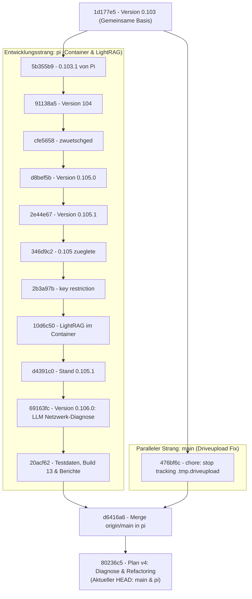

# Grafische Darstellung der Git-Historie (Nodges)

## Kernaussage

Ja, hier ist die grafische Darstellung der Git-Historie von Nodges, welche die Entwicklung ueber den Branch `pi`, den Merge mit `main` und den aktuellen gemeinsamen Stand (`80236c5`) abbildet.

## Git-Flussdiagramm

## Erklaerung der Phasen

1. **Gemeinsamer Ausgangspunkt (`1d177e5` - Stand 0.103)**:
   - Bis zu diesem Punkt lief die urspruengliche Entwicklung auf `main`.

2. **Hauptentwicklung auf Branch `pi`**:
   - Ab `5b355b9` fand die Hauptarbeit fuer den Container, die Docker-Harness-Bereitstellung, LightRAG im Container und die Build-13-Erweiterungen im Branch `pi` statt.
   - Versionen stiegen schrittweise ueber `0.104`, `0.105.0`, `0.105.1` bis `0.106.0`.

3. **Pflege auf `main` (`476bf6c`)**:
   - Einziger zwischenzeitlicher Commit auf `main` war das Bereinigen des temporaeren `.tmp.driveupload`-Ordners.

4. **Wiedervereinigung (`d6416a6` & `80236c5`)**:
   - `d6416a6`: Der Stand von `main` wurde komplett in `pi` integriert.
   - `80236c5`: Hinzufuegen von Plan v4.
   - Anschliessend wurde `main` per Fast-Forward auf denselben Commit `80236c5` vorgezogen.
   - Ergebnis: Beide Branches (`main` und `pi`) stehen heute auf exakt derselben Spitze.
