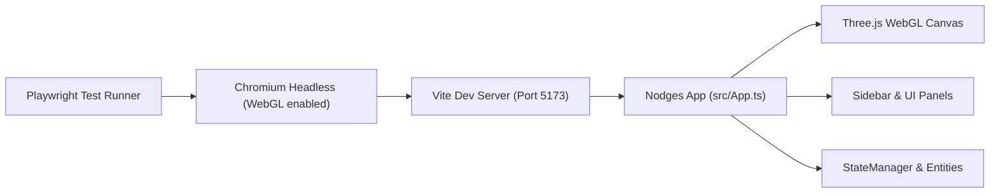

# Implementierungsplan: Playwright E2E-Testing Setup fuer Nodges

Dieser Plan beschreibt die vollstaendige Konfiguration, Installation und Einfuehrung von [Playwright](https://playwright.dev/) als End-to-End- und Browser-Test-Framework fuer [Nodges](file:///C:/Users/ich/Desktop/code/_projects/Nodges/src/App.ts) (Version 0.106.0).

---

## 1. Zielsetzung und Kontext

Bisher verfuegt Nodges ueber 238 Unit- und Modultests via Vitest, jedoch lag die Testabdeckung im UI-Bereich bei lediglich 1,09% und im 3D-Rendering bei 0%. Viele kritische Funktionalitaeten lassen sich nur im echten Browser-Kontext zuverlaessig verifizieren:
- Initialisierung des WebGL-Rendering-Kontexts auf dem HTML5 `<canvas>`-Element.
- DOM-Reaktivitaet der Seitenleiste ([index.html](file:///C:/Users/ich/Desktop/code/_projects/Nodges/index.html)), Tab-Wechsel und Modus-Umschaltung (Simple, Expert, Dev).
- Datei-Operationen ueber die Vite-Server-Middlewares (`/api/list_files`, `/api/save_graph`).
- Mausinteraktionen im 3D-Raum (Orbit-Drehung, Klick-Selektion, Zoom).
- Absicherung gegen ungefangene JavaScript-Laufzeitfehler (`console.error`, unhandled rejections).

---

## 2. Erforderliche Anpassungen

### 2.1 Paket- und Abhaengigkeits-Management
- Hinzufuegen von `@playwright/test` zu `devDependencies` in [package.json](file:///C:/Users/ich/Desktop/code/_projects/Nodges/package.json).
- Einmalige Installation der Playwright-Chromium-Binaries via `npx playwright install chromium`.
- Ergaenzung von Skripten in [package.json](file:///C:/Users/ich/Desktop/code/_projects/Nodges/package.json):
  - `"test:e2e"`: Fuehrt Playwright Headless im Terminal aus.
  - `"test:e2e:ui"`: Startet das interaktive Playwright-UI-Dashboard.
  - `"test:e2e:headed"`: Fuehrt Tests im sichtbaren Browserfenster aus.

### 2.2 Konfigurationsdatei
- Erstellen von [playwright.config.ts](file:///C:/Users/ich/Desktop/code/_projects/Nodges/playwright.config.ts) im Projekt-Root:
  - Test-Verzeichnis: `./e2e`
  - Automatische Anbindung an den Vite-Entwicklungsserver via `webServer`:
    - Befehl: `npm run dev`
    - URL: `http://localhost:5173`
    - `reuseExistingServer`: aktiv im lokalen Betrieb, inaktiv im CI.
  - WebGL-Kompatibilitaet fuer Headless-Chromium:
    - Start-Flags `--use-gl=angle` bzw. `--use-gl=swiftshader` und `--enable-webgl`, damit Three.js auch in Headless-Umgebungen ohne dedizierte GPU zuverlaessig rendert.

### 2.3 Neue E2E-Testsuiten
Neues Verzeichnis: `e2e/`

1. **[e2e/01-app-load.spec.ts](file:///C:/Users/ich/Desktop/code/_projects/Nodges/e2e/01-app-load.spec.ts):**
   - Laedt die Startseite `http://localhost:5173`.
   - Prueft, dass das `<canvas>`-Element im DOM existiert und sichtbar ist.
   - Prueft, dass `window.app` vorhanden und initialisiert ist.
   - Lauscht auf `page.on('console')` und stellt sicher, dass keine schwerwiegenden Fehler protokolliert werden.

2. **[e2e/02-sidebar-and-modes.spec.ts](file:///C:/Users/ich/Desktop/code/_projects/Nodges/e2e/02-sidebar-and-modes.spec.ts):**
   - Klickt durch alle Sidebar-Tabs (`tab-system`, `tab-layers`, `tab-files`, `tab-view`, `tab-create`, `tab-dev`).
   - Prueft, ob die jeweilige Tab-Klasse `active` gesetzt wird und der Tab-Indicator mitwandert.
   - Schaltet zwischen den Modi `simple`, `expert` und `dev` um und prueft die Sichtbarkeit von Elementen mit `data-min-mode`.

3. **[e2e/03-graph-data-loading.spec.ts](file:///C:/Users/ich/Desktop/code/_projects/Nodges/e2e/03-graph-data-loading.spec.ts):**
   - Navigiert zum Files-Tab und waehlt einen Standard-Graphen aus (oder triggert `window.app.fileHandler.loadGraph`).
   - Prueft, dass die Zaehler `#fileNodeCount` und `#fileEdgeCount` groesser als null werden.
   - Prueft, dass `window.app.stateManager.getEntities().length > 0` erfuellt ist.

4. **[e2e/04-canvas-interaction.spec.ts](file:///C:/Users/ich/Desktop/code/_projects/Nodges/e2e/04-canvas-interaction.spec.ts):**
   - Fuehrt Maus-Drag-Gesten auf dem Canvas aus.
   - Verifiziert, dass OrbitControls die Kameraposition veraendern.
   - Fuehrt Klick-Events auf den Canvas aus und prueft, ob die Selektions-Pipeline ohne Laufzeitfehler reagiert.

---

## 3. Architektur-Uebersicht

---

## 4. Verifikationsplan

1. **Paketinstallation:**
   - `npm install -D @playwright/test`
   - `npx playwright install chromium`
2. **Konfiguration & Tests implementieren:**
   - Anlegen von `playwright.config.ts` und den Spezifikationen in `e2e/`.
3. **Ausfuehrung & Test:**
   - Ausfuehren von `npm run test:e2e`.
   - Pruefen der Ausfuehrungszeiten und Bestaetigung aller gruenen Testfaelle.
   - Sicherstellen, dass die bestehenden Vitest-Tests (`npm run test -- --run`) weiterhin parallel und unbeeinflusst funktionieren.
