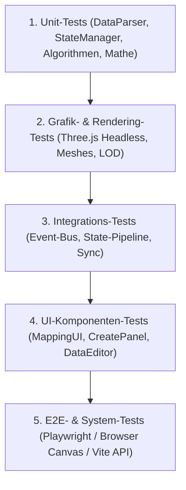

# Testplan fuer die Nodges-Funktionalitaeten

Dieser Testplan definiert eine umfassende, strukturierte Teststrategie zur Verifikation aller Kern- und Erweiterungsfunktionen von [Nodges](file:///C:/Users/ich/Desktop/code/_projects/Nodges/src/App.ts) (Version 0.106.0). Er schliesst bestehende Testluecken, etabliert klare Testebenen und gewaehrleistet funktionale Stabilitaet, Datenintegritaet sowie Performanz.

---

## 1. Uebersicht und Teststrategie

Nodges ist eine komplexe 3D-Netzwerk- und Wissensgraphen-Visualisierungsplattform auf Basis von TypeScript, Three.js, Vite und einem LightRAG-Backend. Die Funktionalitaeten spannen einen Bogen von mathematischen Layout- und Graph-Algorithmen ueber WebGL-Rendering bis hin zu Multi-Step-LLM-Pipelines und interaktiven UI-Panels.

Die Qualitaetssicherung folgt einer fuenfstufigen Testpyramide:

1. **Unit-Tests (Isolierte Logik):** Pure TypeScript-Module, Daten-Parser, Schema-Validierungen, mathematische Berechnungen, State-Operationen.
2. **Grafik- und Szenen-Tests (Headless Three.js):** Mesh-Generierung, Material-Zuweisung, Geometrie-Lifecycle, Raycasting, Kamera-Transformationen.
3. **Integrations-Tests (Modul-Zusammenspiel):** Zusammenspiel zwischen [StateManager](file:///C:/Users/ich/Desktop/code/_projects/Nodges/src/core/StateManager.ts), [LayoutManager](file:///C:/Users/ich/Desktop/code/_projects/Nodges/src/core/LayoutManager.ts), [VisualMappingEngine](file:///C:/Users/ich/Desktop/code/_projects/Nodges/src/core/VisualMappingEngine.ts) und [CentralEventManager](file:///C:/Users/ich/Desktop/code/_projects/Nodges/src/core/CentralEventManager.ts).
4. **UI-Komponenten-Tests (DOM / JSDOM):** Benutzerinteraktionen, Panel-Events, Formularvalidierung, Tastatur-Shortcuts, Menue-Logik.
5. **End-to-End (E2E) & System-Tests:** Vollstaendiger Render-Durchlauf im Browser, Dateispeicher- und Lade-APIs, LightRAG-Anbindung, Performance bei Grossgraphen (> 1.000 Knoten).

---

## 2. Ist-Zustand und Coverage-Analyse

Die Testsuite umfasst **18 aktive Testdateien mit 238 erfolgreichen Tests** (3 Tests uebersprungen).
Eine vollstaendige Messung via `@vitest/coverage-v8` ergab folgende reale Abdeckungswerte nach Modulbereichen:

| Modulbereich | Statement-Coverage | Teststatus & Befund |
|---|---|---|
| `src/core/` | **43.39%** | [LayoutManager](file:///C:/Users/ich/Desktop/code/_projects/Nodges/src/core/LayoutManager.ts) (83.38%) und [StateManager](file:///C:/Users/ich/Desktop/code/_projects/Nodges/src/core/StateManager.ts) (85.46%) sind gut abgedeckt. [NodeManager](file:///C:/Users/ich/Desktop/code/_projects/Nodges/src/core/NodeManager.ts) (0%), [EdgeObjectsManager](file:///C:/Users/ich/Desktop/code/_projects/Nodges/src/core/EdgeObjectsManager.ts) (0%), [CameraManager](file:///C:/Users/ich/Desktop/code/_projects/Nodges/src/core/CameraManager.ts) (0%) und [CentralEventManager](file:///C:/Users/ich/Desktop/code/_projects/Nodges/src/core/CentralEventManager.ts) (0%) sind ungetestet. |
| `src/utils/` | **21.00%** | [ImportManager](file:///C:/Users/ich/Desktop/code/_projects/Nodges/src/utils/ImportManager.ts) (81.38%), [ExportManager](file:///C:/Users/ich/Desktop/code/_projects/Nodges/src/utils/ExportManager.ts) (71.63%) und [VectorStoreManager](file:///C:/Users/ich/Desktop/code/_projects/Nodges/src/utils/VectorStoreManager.ts) (86.27%) sind solide. [PathFinder](file:///C:/Users/ich/Desktop/code/_projects/Nodges/src/utils/PathFinder.ts) (0%), [NetworkAnalyzer](file:///C:/Users/ich/Desktop/code/_projects/Nodges/src/utils/NetworkAnalyzer.ts) (0%), [RaycastManager](file:///C:/Users/ich/Desktop/code/_projects/Nodges/src/utils/RaycastManager.ts) (0%) und [AxisPositionHelper](file:///C:/Users/ich/Desktop/code/_projects/Nodges/src/utils/AxisPositionHelper.ts) (0%) weisen null Testabdeckung auf. |
| `src/ui/` | **1.09%** | Nahezu voellig ungetestet (ausser [MinimapUI](file:///C:/Users/ich/Desktop/code/_projects/Nodges/src/ui/MinimapUI.ts) mit 78.57%). [MappingUI](file:///C:/Users/ich/Desktop/code/_projects/Nodges/src/ui/MappingUI.ts) (0%), [CreatePanel](file:///C:/Users/ich/Desktop/code/_projects/Nodges/src/ui/CreatePanel.ts) (0%), [FilePanelUI](file:///C:/Users/ich/Desktop/code/_projects/Nodges/src/ui/FilePanelUI.ts) (0%) und [DataEditor](file:///C:/Users/ich/Desktop/code/_projects/Nodges/src/ui/DataEditor.ts) (0%) benoetigen strukturierte DOM-Tests. |
| `src/effects/` | **0.00%** | [HighlightManager](file:///C:/Users/ich/Desktop/code/_projects/Nodges/src/effects/HighlightManager.ts) (0%) und [GlowEffect](file:///C:/Users/ich/Desktop/code/_projects/Nodges/src/effects/GlowEffect.ts) (0%) besitzen bisher keine Testfaelle. |
| `src/workers/` | **0.00%** | Web-Worker-Skripte fuer Layout-Berechnung (`layout-worker.ts`) werden im Node-Runner bisher nicht direkt ausgefuehrt. |

---

## 3. Detaillierter Testkatalog nach Domaenen

### 3.1 Domaene: Daten- & Schema-Pipeline
Ziel: Sicherstellen, dass jeder Graph datenseitig konsistent geparst, validiert und normalisiert wird.

- **Testfall D1.1: Zod-Schema-Konformitaet aller Beispieldatensaetze**
  - Eingabe: Alle JSON-Dateien aus `public/data/` (einschliesslich B10, B12, Default-Datenbanken).
  - Erwartung: Erfolgreiches Parsen durch [DataParser](file:///C:/Users/ich/Desktop/code/_projects/Nodges/src/core/DataParser.ts) ohne Validierungsfehler.
- **Testfall D1.2: Abwaertskompatibilitaet aelterer Builds**
  - Eingabe: Graphdaten mit Schema-Versionen "5.0", "5.1", "5.2" sowie Dateien ohne Versionsattribut.
  - Erwartung: Automatischer Fallback auf Version 5.0 und saubere Normalisierung der Knoten-/Kantenfelder.
- **Testfall D1.3: Normalisierung numerischer und kategorialer Mappings**
  - Eingabe: Attributbereiche mit Min/Max oder Enum-Wertelisten.
  - Erwartung: Automatische Zuweisung von Farbskalen und Koordinaten-Transformationen im Visual-Mapping-Block.
- **Testfall D1.4: Synthese temporaler Attribute**
  - Eingabe: Unstrukturierte Datumsangaben (`startYear`, `endYear`, ISO-Datumsstrings).
  - Erwartung: Konvertierung in ein valides `temporal`-Objekt mit Start- und End-Timestamp.

### 3.2 Domaene: State-Management & Historie
Ziel: Vollstaendige Nachvollziehbarkeit aller Aenderungen an Knoten, Kanten und Gruppierungen.

- **Testfall S2.1: Atomare Transaktionen (Batch-Operationen)**
  - Ablauf: Oeffnen einer Transaktion ueber [StateManager](file:///C:/Users/ich/Desktop/code/_projects/Nodges/src/core/StateManager.ts), Hinzufuegen von 5 Knoten und 4 Kanten, Commit.
  - Erwartung: Ein einzelner Undo-Schritt stellt exakt den Ausgangszustand vor Beginn der Transaktion wieder her.
- **Testfall S2.2: Kanten-basierte Gruppenbildung**
  - Ablauf: Erstellen von `membership`-Kanten zwischen Knoten und Gruppenknoten. Loeschen eines Gruppenknotens.
  - Erwartung: Kaskadierendes Entfernen aller zugehoerigen Mitgliedschaftskanten; unbeteiligte Knoten bleiben unberuehrt.
- **Testfall S2.3: Multiselektion und Duplikation mit Kanten-Remapping**
  - Ablauf: Selektion von 2 verbundenen Knoten. Ausfuehrung von `duplicateSelected()`.
  - Erwartung: 2 neue Knoten mit neuen eindeutigen IDs; eine neue Kante, die ausschliesslich die beiden neuen Knoten verbindet.
- **Testfall S2.4: Undo/Redo Stack-Ueberlauf**
  - Ablauf: Ausfuehren von 60 sequentiellen Mutationen.
  - Erwartung: Die Historie ist strikt auf maximal 50 Eintraege begrenzt; aelteste Zustaende werden sauber verworfen.

### 3.3 Domaene: Layout-Algorithmen & Koordinatensysteme
Ziel: Deterministische, kreuzungsarme und kollisionsfreie Platzierung von Entitaeten im 3D-Raum.

- **Testfall L3.1: Force-Directed 3D Konvergenz**
  - Eingabe: Ein Graph mit 100 Knoten im [LayoutManager](file:///C:/Users/ich/Desktop/code/_projects/Nodges/src/core/LayoutManager.ts).
  - Erwartung: Nach N Iterationen sinkt die Gesamtenergie des Systems unter den Schwellenwert; keine zwei Knoten ueberlappen exakt.
- **Testfall L3.2: Kategoriales 3D-Zonen-Layout**
  - Eingabe: Knoten mit kategorialem Attribut (z.B. Partei, Typ).
  - Erwartung: Knoten derselben Kategorie befinden sich innerhalb definierter raeumlicher Bounding-Boxen / Cluster-Zentren.
- **Testfall L3.3: Achsen-Mapping (AxisPositionHelper)**
  - Eingabe: X-Achse gemappt auf Jahr (numerisch), Y-Achse gemappt auf Relevanz (0.0 bis 1.0).
  - Erwartung: [AxisPositionHelper](file:///C:/Users/ich/Desktop/code/_projects/Nodges/src/utils/AxisPositionHelper.ts) berechnet exakte lineare Koordinaten; nicht gemappte Achsen fallen auf Null zurueck.
- **Testfall L3.4: Web-Worker-Berechnung & Fallback**
  - Ablauf: Starten des Layout-Workers `layout.worker.ts`.
  - Erwartung: Asynchrone Antwort mit aktualisierten Koordinaten; bei Worker-Fehlern nahtloser synchroner Fallback im Main-Thread.

### 3.4 Domaene: 3D-Rendering & Three.js Szenen-Management
Ziel: Korrekte grafische Repraesentation und optimales Speichermanagement in Three.js.

- **Testfall R4.1: Mesh-Generierung durch NodeManager**
  - Ablauf: Instanziierung von Knoten mit verschiedenen Geometrie-Typen (Kugel, Box, Tetraeder) im [NodeManager](file:///C:/Users/ich/Desktop/code/_projects/Nodges/src/core/NodeManager.ts).
  - Erwartung: Korrekte Zuweisung von BufferGeometry, MeshStandardMaterial und userData.
- **Testfall R4.2: Kanten-Geometrien und Kurven durch EdgeObjectsManager**
  - Ablauf: Erstellen gerader und gebogener Kanten im [EdgeObjectsManager](file:///C:/Users/ich/Desktop/code/_projects/Nodges/src/core/EdgeObjectsManager.ts).
  - Erwartung: Valide Three.js Line- oder Tube-Geometrien; korrekte Ausrichtung von Pfeilspitzen in Richtung des Zielknotens.
- **Testfall R4.3: Ressourcen-Freigabe (Memory-Leak-Praevention)**
  - Ablauf: Laden eines Graphen, anschliessend vollstaendiges Leeren (`clearGraph()`).
  - Erwartung: Aufruf von `geometry.dispose()` und `material.dispose()` fuer alle verworfenen Meshes; Szene enthaelt null verwaiste Objekte.
- **Testfall R4.4: Kamera-Fokussierung und Tweening**
  - Ablauf: Aufruf von `focusOnNode(nodeId)` im [CameraManager](file:///C:/Users/ich/Desktop/code/_projects/Nodges/src/core/CameraManager.ts).
  - Erwartung: Kameraposition und OrbitControls-Ziel bewegen sich kontinuierlich via Tween auf die Knotenposition zu.

### 3.5 Domaene: Interaktion, Selektion & Analyse
Ziel: Praezise Zeiger- und Tastatureingaben sowie mathematische Graph-Metriken.

- **Testfall I5.1: Raycasting & Hover-Erkennung**
  - Ablauf: Simulation von Mauskoordinaten ueber dem Viewport via [RaycastManager](file:///C:/Users/ich/Desktop/code/_projects/Nodges/src/utils/RaycastManager.ts).
  - Erwartung: Genau das getroffene Knoten- oder Kanten-Mesh wird erkannt; Hover-Events feuern zuverlaessig.
- **Testfall I5.2: Kuerzeste-Pfad-Findung (PathFinder)**
  - Ablauf: Suche des kuerzesten Pfades zwischen Start- und Zielknoten via [PathFinder](file:///C:/Users/ich/Desktop/code/_projects/Nodges/src/utils/PathFinder.ts) (Dijkstra und A*).
  - Erwartung: Rueckgabe der minimalen Kantenfolge; korrekte Fehlerbehandlung wenn keine Verbindung existiert.
- **Testfall I5.3: Graph-Kennzahlen (NetworkAnalyzer)**
  - Eingabe: Ein definierter Testgraph mit bekannten Zentralitaetswerten.
  - Erwartung: [NetworkAnalyzer](file:///C:/Users/ich/Desktop/code/_projects/Nodges/src/utils/NetworkAnalyzer.ts) liefert exakte Werte fuer Knotengrad, Dichte, Clusterkoeffizient und verbundene Komponenten.
- **Testfall I5.4: Tastatur-Shortcuts**
  - Ablauf: Simulation von Tastaturevents (`Strg+Z`, `Strg+Y`, `Entf`, `F`).
  - Erwartung: Ausloesung der jeweiligen Aktion (Undo, Redo, Loeschen, Fokus) ohne Seiteneffekte in Texteingabefeldern.

### 3.6 Domaene: Temporale Visualisierung & Animation
Ziel: Dynamische Filterung und Zeitreisen durch zeitbasierte Graphen.

- **Testfall T6.1: Zeitfenster-Filterung**
  - Ablauf: Verschieben des Zeitschiebereglers in [TimePlayerUI](file:///C:/Users/ich/Desktop/code/_projects/Nodges/src/ui/TimePlayerUI.ts) auf ein bestimmtes Jahr.
  - Erwartung: Knoten und Kanten ausserhalb des Zeitbereichs werden ausgeblendet oder ihre Opazitaet wird gedaempft.
- **Testfall T6.2: Automatische Wiedergabe (Playback)**
  - Ablauf: Klick auf "Abspielen" mit Geschwindigkeitsfaktor 2x.
  - Erwartung: Kontinuierlicher Fortschritt des Zeitstrahls; Animation feuert gleichmaessige Frame-Updates ueber `requestAnimationFrame`.

### 3.7 Domaene: KI-, LLM- & LightRAG-Pipelines
Ziel: Stabilitaet der Text-zu-Graph-Generierung und Wissensintegration.

- **Testfall K7.1: Multi-Step LLM Prompt Generierung (Build 10 / Build 12)**
  - Ablauf: Mocken von LLM-API-Antworten in [LLMService](file:///C:/Users/ich/Desktop/code/_projects/Nodges/src/utils/LLMService.ts) fuer die aufeinander aufbauenden Extraktionsschritte (Entitaeten, Relationen, Attribute, Gruppierungen).
  - Erwartung: Vollstaendiges Graph-JSON gemaess Schema; saubere Fehlerbehandlung bei unvollstaendigen LLM-Antworten.
- **Testfall K7.2: LightRAG Backend-Kommunikation**
  - Ablauf: Pruefen der Endpunkte `/health`, `/query` und `/insert` via [LightRAGService](file:///C:/Users/ich/Desktop/code/_projects/Nodges/src/utils/LightRAGService.ts).
  - Erwartung: Bei Offline-Backend reagiert das Frontend mit Status-Warnung (HTTP 503 Fallback); bei Online-Backend werden Antworten korrekt verarbeitet.
- **Testfall K7.3: Vektor-Deduplizierung**
  - Ablauf: Uebergabe zweier Knoten mit semantisch identischen Beschreibungen an den [VectorStoreManager](file:///C:/Users/ich/Desktop/code/_projects/Nodges/src/utils/VectorStoreManager.ts).
  - Erwartung: Zusammenfuehrung zu einem Repraesentanten und automatisches Umbiegen aller eingehenden und ausgehenden Kanten.

### 3.8 Domaene: Vite-Server-APIs & Dateiverwaltung
Ziel: Zuverlaessiges Speichern, Laden und Verwalten von Graphdateien im lokalen Dateisystem.

- **Testfall A8.1: Graph speichern (`POST /api/save_graph`)**
  - Ablauf: Senden von JSON-Payload an den Vite-Dev-Server.
  - Erwartung: Datei wird unter `public/data/generated/<filename>` angelegt; HTTP 200 wird zurueckgegeben.
- **Testfall A8.2: Dateien auflisten (`GET /api/list_files`)**
  - Ablauf: Abfrage aller verfuegbaren Datensaetze.
  - Erwartung: Vollstaendige Liste aller `.json`-Dateien inklusive Unterverzeichnissen.
- **Testfall A8.3: Datenbank erstellen & loeschen (`POST /api/create_database` & `DELETE /api/delete_file`)**
  - Ablauf: Erstellen einer neuen DB-Struktur und anschliessendes Loeschen.
  - Erwartung: Dateisystem-Operationen erfolgen atomar; ungueltige Dateinamen werden mit HTTP 400 abgewiesen.

---

## 4. Test-Infrastruktur und Werkzeuge

Zur Umsetzung des Testplans werden folgende Werkzeuge und Umgebungen eingesetzt:

| Ebene / Zweck | Werkzeug / Bibliothek | Konfiguration & Besonderheiten |
|---|---|---|
| Test-Runner & Assertion | Vitest 1.6.1 | Extrem schnell, native TypeScript- & ESM-Unterstuetzung |
| DOM-Simulation | Happy-DOM / JSDOM | Ausfuehrung von UI-Komponententests ohne echten Browser |
| WebGL & Three.js Mocking | Headless Mock / Vitest Setup | Mocking von `WebGLRenderer`, `requestAnimationFrame` und ResizeObserver |
| Worker-Testing | Vitest Inline-Worker / Mock | Web Worker fuer LayoutManager in Node-Umgebung mocken |
| Code-Coverage | `@vitest/coverage-v8` | Erfassung von Statement-, Branch- und Function-Coverage |
| E2E- & Canvas-Testing | Playwright (geplant) | Testen echter Canvas-Pixel, Kontextmenues und Datei-Uploads im Chromium |

---

## 5. Phasenweiser Umsetzungs-Fahrplan

Die Umsetzung erfolgt in fuenf aufeinander aufbauenden Phasen, priorisiert nach Kritikalitaet:

### Phase 1: Schliessen der Luecken in Core & Grafik (Prioritaet: Sehr hoch)
- [ ] Erstellen von `src/tests/NodeManager.test.ts`: Testen von Mesh-Erstellung, Geometrie-Typen, Material-Aktualisierung und `dispose()`.
- [ ] Erstellen von `src/tests/EdgeObjectsManager.test.ts`: Testen von Linien, Bezier-Kurven, Pfeilen und Partikeln.
- [ ] Erstellen von `src/tests/CameraManager.test.ts`: Testen von Kamera-Tweening, Fokus-Koordinaten und Resets.

### Phase 2: Graph-Algorithmen & Interaktions-Tests (Prioritaet: Hoch)
- [ ] Erstellen von `src/tests/PathFinder.test.ts`: Verifikation von Dijkstra, A* und BFS mit gewichteten Kanten.
- [ ] Erstellen von `src/tests/NetworkAnalyzer.test.ts`: Verifikation aller mathematischen Graph-Kennzahlen.
- [ ] Erstellen von `src/tests/HighlightManager.test.ts`: Verifikation von 1-Hop-/2-Hop-Nachbarschaftsfiltern und Selektions-Pulsing.

### Phase 3: UI-Panels & Interaktions-Logik (Prioritaet: Mittel)
- [ ] Erstellen von `src/tests/MappingUI.test.ts`: Pruefen von Schiebereglern, Farbwaehlern und Attribut-Zuordnungen.
- [ ] Erstellen von `src/tests/TimePlayerUI.test.ts`: Pruefen von Zeitbereichs-Filtern und Playback-Intervallen.
- [ ] Erstellen von `src/tests/DataEditor.test.ts`: Pruefen von Inline-Attribut-Aenderungen und State-Sync.

### Phase 4: Server-APIs & Integrations-Pipeline (Prioritaet: Mittel)
- [ ] Erstellen von `src/tests/ServerAPI.test.ts`: Testen der Express/Connect-Middlewares in `vite.config.ts`.
- [ ] Erstellen von `src/tests/LLMPipelineBuild12.test.ts`: Vollstaendiger Integrations-Test der Build-12-Prompt-Extraktion mit gemockten LLM-Antworten.

### Phase 5: E2E- & Performance-Tests (Prioritaet: Erweitert)
- [ ] Einrichtung einer minimalen Playwright-Testsuite fuer UI-Rauchtests (Smoke Tests).
- [ ] Erstellen eines Performance-Benchmarks: Messung der Framerate (FPS) und Speichernutzung bei 500, 1.000 und 3.000 Knoten.

---

## 6. Qualitaetskriterien und Definition of Done (DoD)

Fuer jeden implementierten Test gelten folgende Kriterien:
1. **Deterministisch & Isoliert:** Tests duerfen keine Abhaengigkeiten untereinander aufweisen und muessen in beliebiger Reihenfolge stabil laufen.
2. **Frei von externen Seiteneffekten:** LLM-APIs, Netzwerkdienste und Dateisysteme werden in Unit- und Integrationstests gemockt.
3. **Ausfuehrungszeit:** Die gesamte Unit- und Integrations-Testsuite muss in unter 15 Sekunden durchlaufen.
4. **Keine Warnungen / Sauberes Aufraeumen:** Three.js-Ressourcen werden in `afterEach` bereinigt; keine unhandled Promise Rejections.
5. **Coverage-Ziel:** Mindestens 80% Statement-Coverage in den Geschaeftslogik-Paketen (`core/` und `utils/`).
