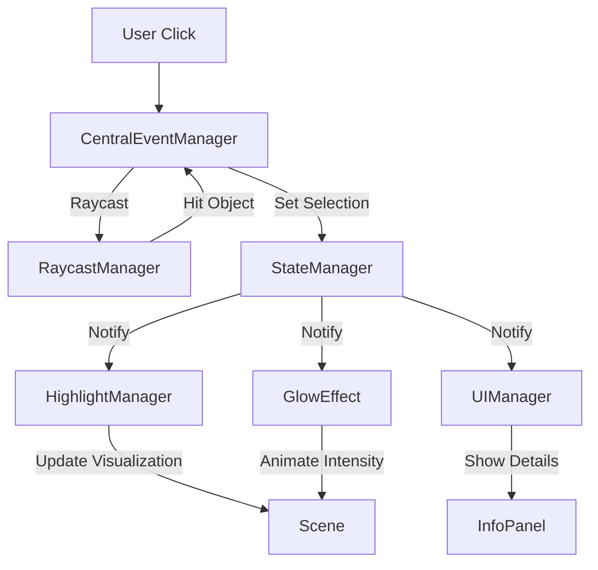

# 02 Systemarchitektur und Design-Prinzipien

Dieses Kapitel widmet sich dem technischen Fundament von Nodges. Die Architektur folgt strikten Prinzipien der Modularisierung und Entkopplung, um Wartbarkeit und Erweiterbarkeit zu gewährleisten.

## 02.1 Architektur-Überblick

Nodges implementiert eine Architektur, die stark auf dem **Manager-Pattern** basiert. Anstatt einer monolithischen Applikationslogik werden Verantwortlichkeiten in spezialisierte Manager-Klassen ausgelagert. Die Klasse `App` fungiert hierbei als Orchestrator und Einstiegspunkt, enthält aber selbst nur minimale Geschäftslogik.

### Das Manager-Ecosystem
Jeder Aspekt der Anwendung wird von einem dedizierten Manager verwaltet:
*   `NodeObjectsManager` / `EdgeObjectsManager`: Verwalten die 3D-Repräsentation.
*   `LayoutManager`: Berechnet Positionen.
*   `HighlightManager`: Steuert visuelle Effekte.
*   `UIManager`: Verwaltet das HTML-Overlay.

### Dependency Injection & Kopplung
Die `App`-Klasse initialisiert alle Manager und injiziert notwendige Abhängigkeiten (wie `scene`, `camera` oder andere Manager) in deren Konstruktoren. Dies ermöglicht eine klare Hierarchie.
Um eine zu enge Kopplung ("Spaghetti-Code") zu vermeiden, kommunizieren Manager untereinander primär über zwei Mechanismen:
1.  **Shared State** (via `StateManager`)
2.  **Events** (via `CentralEventManager`)

## 02.2 Zentrales Zustandsmanagement (`StateManager`)

Der `StateManager` ist das Herzstück der Reaktivität in Nodges. Er folgt dem **Single Source of Truth** Prinzip.

### Reaktives State-Design
Der gesamte Anwendungszustand (Selektion, Hover, UI-Sichtbarkeit, Einstellungen) wird in einem zentralen `State`-Objekt gehalten. Manager halten keinen redundanten Zustand, sondern lesen diesen aus dem `StateManager` oder abonnieren Änderungen.

### Observer-Pattern (Subscribe/Notify)
Der `StateManager` implementiert ein klassisches Observer-Pattern:
```typescript
// Beispiel: Ein Manager abonniert Änderungen
stateManager.subscribe((state) => {
    if (state.selectedObject) {
       // Reagiere auf Selektion
    }
}, 'categoryName');
```
Änderungen am State werden über `update()` oder `batchUpdate()` ausgelöst, was automatisch alle Subscriber benachrichtigt. Dies entkoppelt den Auslöser einer Änderung (z.B. User klickt) von der Reaktion (z.B. Info-Panel öffnet sich).

### Batch-Updates
Um unnötige Render-Zyklen oder Rechenoperationen zu vermeiden, unterstützt der `StateManager` atomare Batch-Updates. Mehrere Änderungen (z.B. "Selektiere Objekt X" UND "Öffne Info-Panel" UND "Aktiviere Glow") werden gesammelt und lösen nur *eine* Benachrichtigung an die Subscriber aus.

## 02.3 Event-Driven Architecture (`CentralEventManager`)

Der `CentralEventManager` (CEM) abstrahiert die rohen Browser-Events und bietet eine einheitliche Schnittstelle für Interaktionen.

### Entkopplung von Input und Logik
Anstatt dass jeder Manager eigene `addEventListener` am DOM registriert, laufen alle Inputs (Maus, Tastatur, Touch) über den CEM. Dieser normalisiert die Events und reichert sie mit Kontext an (z.B. "Welches 3D-Objekt wurde getroffen?").

### Event-Bus System
Der CEM fungiert auch als globaler Event-Bus. Komponenten können Custom Events publishen (`publish('PROJECT_LOADED', data)`) und subscriben. Dies ist besonders nützlich für lose gekoppelte Systemteile, die nicht direkten Zugriff aufeinander haben sollen.

### Interaktions-Pipeline
1.  **Raw Input**: Browser feuert `mousemove` oder `click`.
2.  **Normalization**: CEM berechnet relative Koordinaten.
3.  **Contextualization**: Raycaster ermittelt getroffenens 3D-Objekt.
4.  **Distribution**: CEM benachrichtigt StateManager oder feuert spezifische Events.
5.  **Debouncing**: Hover-Events werden gedrosselt (z.B. 100ms), um Performance-Spikes bei schnellen Mausbewegungen zu verhindern.

## 02.4 Datenfluss-Diagramme

Der Datenfluss in Nodges ist unidirektional konzipiert, um Seiteneffekte zu minimieren.

### Flow: Daten-Import bis Rendering
```mermaid
graph LR
    JSON[JSON Data] -->|Load| DP[DataParser]
    DP -->|Validate & Normalize| GD[GraphData]
    GD -->|Inject| NOM[NodeObjectsManager] & EOM[EdgeObjectsManager]
    NOM -->|Generate Geometry| IM_N[InstancedMesh (Nodes)]
    EOM -->|Generate Geometry| IM_E[InstancedMesh (Edges)]
    IM_N & IM_E -->|Add to| Scene[THREE.Scene]
    Scene -->|Render| Canvas
```

### Flow: User-Interaktion (Selektion)


---
*Ende Kapitel 02*
