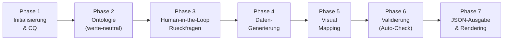

# Build 5 Analyse: IST vs. SOLL fuer den Create Tab

## 1. Zusammenfassung der Ausgangslage

Der Create Tab in Nodges erzeugt JSON-Dateien fuer die 3D/4D-Visualisierung, indem er Benutzeranweisungen ueber ein LLM verarbeitet. Die aktuelle Implementierung basiert auf **Build 4** und zeigt mehrere strukturelle Luecken gegenueber der geplanten **Build 5**-Vision.

---

## 2. IST-Zustand (Build 4)

### Architektur
- **2-Schritt-Pipeline** (`generateGraphDataMultiStep`):
  1. Ontologie-Entwurf (`ontology_prompt.md`) → leeres Schema
  2. Datengenerierung (`build_4_prompt.md`) → befuelltes JSON
- **1-Schritt-Alternativen**: One-Shot und Refine-Modus
- **Schema-Version**: `"4.0"`

### Vorhandene Prompt-Dateien (`/public/prompts/`)
| Datei | Zweck |
|:---|:---|
| `ontology_prompt.md` | Nur Schema, leere data-Arrays |
| `build_4_prompt.md` | Standard-Generierung mit Regeln |
| `build_4_few_shot.md` | Generierung + Gold-Standard-Beispiel |
| `build_3_prompt.md` | Legacy |
| `default_prompt.md` | Legacy |

### Bekannte Schwaechen (aus Dokumenten extrahiert)
1. **Keine Competency Questions** → LLM erzeugt Attribute ohne klares Ziel
2. **Keine Human-in-the-Loop-Phase** → Nutzer sieht Schema erst nach vollstaendiger Generierung
3. **Visual Mapping im Ontologie-Schritt** → Visuelle Zuweisungen passieren blind, ohne Kenntnis der tatsaechlichen Datenverteilung
4. **Keine Validierung** → Dangling Edges, fehlende Pflichtfelder werden nicht abgefangen
5. **Kein explizites Null/Undefined-Handling** im Prompt
6. **Kein separater Visual-Mapping-Schritt** nach der Datengenerierung

---

## 3. SOLL-Zustand (Build 5)

### 7-Phasen-Pipeline (aus `build_5_plan.md`)

### Kernprinzipien (aus den Analyse-Dokumenten)
| Prinzip | Quelle |
|:---|:---|
| Dynamische Ontologie statt starrer Facettierung | `llm_multidimensionale_betrachtung.md` |
| Flache Strukturen + Semantische Kanten | `llm_generierungs_leitfaden.md` |
| Typ-spezifische Attribute, kein Nesting | `llm_methodiken_nodges.md` |
| Competency Questions als Steuerungsinstrument | `build_5_plan.md` |
| Visual Mapping erst NACH Datenbefuellung | `build_5_plan.md` |
| Explizites Null/Undefined-Handling | `plan_build_5_prompt.md` |

---

## 4. Luecken-Analyse (Gap Analysis)

| # | Luecke | IST (Build 4) | SOLL (Build 5) | Betroffene Dateien |
|:--|:---|:---|:---|:---|
| G1 | Competency Questions | Nicht vorhanden | Phase 1: LLM leitet 3-5 Kernfragen ab | `CreatePanel.ts`, neuer Prompt |
| G2 | Werte-neutrale Ontologie | Ontologie enthaelt bereits `visualMappings` | Phase 2: Nur `dataModel`, kein Visual Mapping | `ontology_prompt.md` → neu: `build_5_ontology.md` |
| G3 | Human-in-the-Loop | Nicht vorhanden | Phase 3: Schema-Vorschau und Nutzerfreigabe | `CreatePanel.ts` (neue UI-Sektion) |
| G4 | Separates Visual Mapping | Im Ontologie-Schritt eingebettet | Phase 5: Eigener LLM-Schritt nach Datenbefuellung | `LLMService.ts`, neuer Prompt |
| G5 | Validierung | Nur `data.entities`/`relationships`-Check | Phase 6: Referenz-Integritaet, Datentypen | `LLMService.ts` oder neue Klasse |
| G6 | Null/Undefined-Handling | Nicht explizit | Explizit im Prompt definiert | Alle Prompt-Dateien |
| G7 | Schema-Version | `"4.0"` | `"5.0"` | Alle Prompts, `types.ts` |
| G8 | Kanten mit Properties | Kanten haben leeres `properties: {}` | Kanten tragen eigene Attribute (Intensitaet, Dauer) | Prompt + `dataModel`-Typ |

---

## 5. Loesungsstrategie: 4 Arbeitspakete

### AP-1: Prompt-Dateien (3 neue Dateien)
- `build_5_ontology.md` → Werte-neutraler Ontologie-Entwurf mit Competency Questions
- `build_5_data.md` → Datengenerierung mit strenger Schema-Bindung und Null-Handling
- `build_5_visual.md` → Separates Visual Mapping basierend auf tatsaechlicher Datenverteilung

### AP-2: Schema-Anpassung
- JSON-Schema (`build_5_schema.json`) als maschinenlesbarer Vertrag
- Schema-Version `"5.0"` mit erweiterten Edge-Properties

### AP-3: LLMService-Erweiterung
- Neue Methode `generateGraphDataBuild5()` mit 5-Schritt-Pipeline
- Kompetenzfragen-Extraktion aus LLM-Antwort (Schritt 1)
- Separater Visual-Mapping-Schritt (Schritt 4)
- Validierungs-Logik (Schritt 5)

### AP-4: CreatePanel UI
- Wizard-aehnlicher Ablauf mit Fortschrittsanzeige
- Schema-Vorschau vor Datengenerierung
- Competency-Questions-Anzeige und Editierbarkeit

---

## 6. Empfohlene Reihenfolge

> [!IMPORTANT]
> Die Prompt-Dateien (AP-1) und das Schema (AP-2) sollten **zuerst** erstellt und getestet werden, bevor der Code angepasst wird. So kann die Qualitaet der LLM-Ausgaben verifiziert werden, ohne Code-Aenderungen zu riskieren.

1. **AP-1** → Prompts schreiben und manuell mit LLM testen
2. **AP-2** → Schema definieren
3. **AP-3** → LLMService erweitern
4. **AP-4** → CreatePanel UI anpassen
