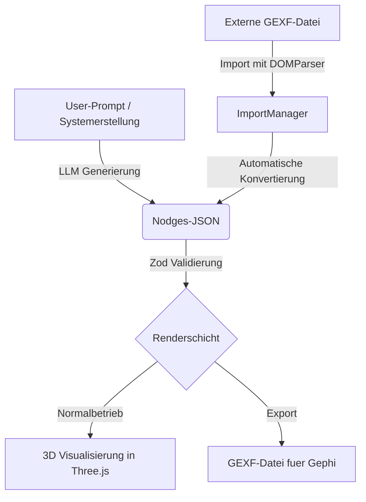

# Technische Evaluierung: GEXF-Format in Nodges

## 1. Kurzantwort und Empfehlung

Die vollstaendige Umstellung des nativen Nodges-Datenformats auf GEXF ist nicht ratsam, da GEXF die Kernfunktionen der dynamischen visuellen Mappings und der Ontologie-Trennung nicht unterstuetzt und XML fuer LLM-Generierungen ineffizient sowie fehleranfaellig ist; eine Erweiterung der bestehenden Import- und Exportschnittstellen fuer GEXF sowie die Uebernahme spezifischer GEXF-Features wie Zeit-Spells in das JSON-Format ist jedoch sehr sinnvoll.

---

## 2. Status Quo der GEXF-Unterstuetzung in Nodges

Nodges besitzt bereits eine funktionierende, wenn auch vereinfachte Schnittstelle fuer den Import und Export von GEXF-Dateien:

*   **Import (`ImportManager.ts`)**: Ueber den `DOMParser` wird die XML-Struktur einer GEXF-Datei eingelesen. Knoten (`node`), Kanten (`edge`), deren Positionen (`viz:position`), Farben (`viz:color`), Groessen (`viz:size`) sowie benutzerdefinierte Attribute (`attvalue`) werden extrahiert und in ein flaches, internes JSON-Datenmodell (`ImportedData`) konvertiert.
*   **Export (`ExportManager.ts`)**: Die Methode `exportGEXF` schreibt die aktuellen Knoten und Kanten inklusive ihrer im 3D-Raum berechneten Positionen und zugewiesenen Farben als standardkonforme GEXF-XML-Datei (Version 1.2draft) zurueck.

### Defizite der aktuellen Implementierung:
1.  **Keine Dynamik**: GEXF-Zeitdaten (`spells`, `start`, `end`) werden beim Import ignoriert.
2.  **Keine Hierarchien**: GEXF-Hierarchiestrukturen (verschachtelte Knoten via `pid`-Attribut) werden verworfen.
3.  **Flache Struktur**: Attribute werden ungeprueft in Metadaten ueberfuehrt, ohne das strenge `dataModel` (Ontologie) von Nodges zu deklarieren.

---

## 3. Evaluierung: GEXF als Ersatz fuer das native Nodges-JSON

Ein vollstaendiger Ersatz des eigenen JSON-Formats durch GEXF wuerde die Architektur von Nodges fundamental schaedigen.

### 3.1. Semantischer Verlust (Kernproblem)
GEXF is ein reiner **Daten- und Ergebniscontainer**. Es speichert das Endprodukt einer Visualisierung (statische Koordinaten, feste RGB-Farben), aber **nicht die Regeln**, nach denen diese Visualisierung aufgebaut wird.

*   **Fehlen von Visual Mappings**: Das Kernstueck von Nodges ist das Regelsystem (z.B. "mappe das Attribut *Kreativitaet* logarithmisch auf den visuellen Kanal *Glow* unter Verwendung der Farbpalette *sunset*"). Diese Regeln koennen in GEXF nicht abgebildet werden.
*   **Fehlen der Physik-Kanaele**: Kanaele wie `attraction`, `repulsion` und `inertia`, welche die 3D-Krafte-Engine steuern, existieren im GEXF-Standard nicht.
*   **Fehlen von Kraftfeldern und Pfaden**: Das `fields`-Array (Kraftfelder) sowie komplexe Kantenanimationen koennen nicht standardkonform in GEXF hinterlegt werden.

### 3.2. LLM-Kompatibilitaet und Token-Effizienz
Die Verwendung von GEXF bei der Erstellung ("Create System") durch eine KI bringt erhebliche Nachteile:

1.  **XML-Syntaxfehler**: LLMs generieren JSON deutlich fehlerfreier als XML. Fehlende schliessende Tags, falsche Namespace-Praefixe (`viz:`) und XML-Entity-Escaping erhoehen die Fehlerquote dramatisch.
2.  **Token-Overhead**: XML ist durch seine redundante Tag-Struktur bei identischem Informationsgehalt ca. 2,5-mal groesser als JSON. Dies erhoeht die API-Kosten und die Latenzzeiten bei der Systemerstellung spuerbar.
3.  **Keine structured outputs**: Moderne LLM-APIs bieten native JSON-Validierung zur Laufzeit (Structured Outputs via JSON Schema). Fuer XML existiert kein vergleichbares, schnelles Validierungsverfahren direkt in den API-Gateways der Provider.

---

## 4. Evaluierung: GEXF als Import- und Exportformat (Zusaetzliche Lesbarkeit)

Die Beibehaltung und der Ausbau von GEXF als reines Austauschformat ist hochgradig sinnvoll. Es ermoeglicht die Interoperabilitaet mit Standard-Werkzeugen wie **Gephi** oder **NetworkX**.

### 4.1. Ausbau des Imports (GEXF -> Nodges-JSON)
Um die Interoperabilitaet zu maximieren, sollte der Importeur in `ImportManager.ts` erweitert werden:

*   **Zeitachsen-Support**: Auslesen von Spells und Intervallen. Diese koennen direkt in das bestehende `temporal`-System von Nodges uebersetzt werden.
*   **Hierarchie-Konvertierung**: Auslesen des `pid` (Parent-ID) Attributs von GEXF-Knoten, um eine Baumstruktur im Speicher aufzubauen. Nodges koennte diese Daten nutzen, um automatisch Cluster zu bilden.
*   **Automatische Schema-Induktion**: Beim Einlesen der `<attributes>`-Definitionen aus der GEXF-Datei kann automatisch ein `dataModel` (Ontologie) in Nodges erzeugt werden, wodurch nachfolgende visuelle Mappings ueberhaupt erst moeglich werden.

### 4.2. Ausbau des Exports (Nodges-JSON -> GEXF)
Der Exporteur sollte so erweitert werden, dass er die im `dataModel` definierten Attribute als typsichere XML-Attribute deklariert und exportiert, statt diese als flachen Text zu schreiben.

---

## 5. Evaluierung: GEXF bei der Systemerstellung ("Create System")

Wenn der Benutzer die Erstellung eines neuen Graphen durch ein LLM anstoesst, ergeben sich folgende Moeglichkeiten:

### Option A: LLM generiert direkt GEXF-XML
*   **Vorteil**: Keine Konvertierung auf Clientseite notwendig.
*   **Nachteil**: Sehr hohe Fehlerquote der KI bei XML-Strukturen, keine visuellen Mappings moeglich (Graph waere statisch und leblos), hoher Tokenverbrauch.
*   **Bewertung**: Nicht empfohlen.

### Option B: LLM generiert Nodges-JSON (Standard)
*   **Vorteil**: Voller Funktionsumfang (Mappings, Krafte-Engine, Animationen, Ontologie). Perfekte Validierung durch Zod im Browser.
*   **Nachteil**: Proprietaeres Format, das dem LLM im System-Prompt erklaert werden muss (wird bereits erfolgreich umgesetzt).
*   **Bewertung**: Empfohlen als Standardweg.

### Option C: Hybrid-Ansatz (Generierung in JSON, Export/Import in GEXF)
*   Das LLM generiert ein strukturiertes Nodges-JSON.
*   Ueber eine Exportfunktion kann das erstellte System sofort als GEXF heruntergeladen werden, um es in Gephi zu oeffnen.
*   Umgekehrt koennen GEXF-Dateien ueber die GUI importiert und im `FileHandler` automatisch in das semantisch reichere Nodges-JSON konvertiert werden.
*   **Bewertung**: Ideal, da es die Flexibilitaet von JSON mit der Interoperabilitaet von GEXF verbindet.

---

## 6. Strategischer Fahrplan fuer Nodges

Um die Staerken beider Welten optimal zu nutzen, sollte folgendes Vorgehen gewaehlt werden:

### Empfohlene Massnahmen:
1.  **JSON als Kern behalten**: Das native JSON-Format bleibt das primaere Speicher- und Uebertragungsformat fuer die LLM-Pipeline.
2.  **JSON-Schema formalisieren**: Unter Nutzung der bereits installierten Bibliothek `zod-to-json-schema` wird zur Laufzeit ein offizielles JSON-Schema generiert und dem LLM im System-Prompt uebergeben. Dies egalisiert den Vorteil der "Bekanntheit" von GEXF bei LLMs.
3.  **GEXF-Import aufwerten**: Anpassung des `ImportManager.ts`, um dynamische Attribute (`spells`) und Hierarchien (`pid`) korrekt in das interne `temporal`- und Gruppen-System einzupflegen.
4.  **Uebersetzungskomponente**: Bereitstellung einer transparenten Export-Schaltflaeche "Als GEXF exportieren" in der UI, die den aktuellen Zustand des 3D-Graphen in valides XML uebersetzt.
