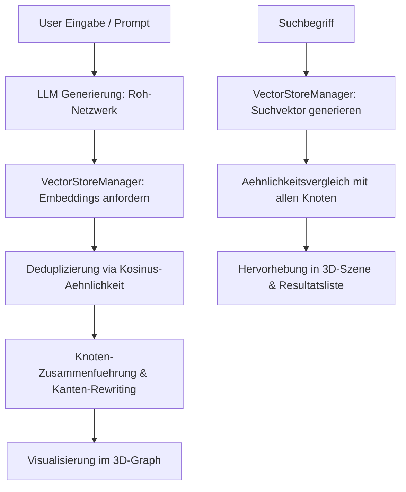

# Dokumentation: Build 9 - Vektorstore-Deduplizierung & Semantische Suche

Diese Dokumentation beschreibt die technische Umsetzung und Integration von Build 9 in der Version 0.102.9 des Projektes Nodges.

---

## 1. Systemarchitektur & Datenfluss

Build 9 kombiniert die bestehende Single-Step LLM-Generierung (aus Build 6) mit einem Vektorstore-basierten Entity-Resolution- und Suchsystem.



---

## 2. Kernkomponenten und Dateien

### 2.1 C:/Users/ich/Desktop/code/_projects/Nodges/src/utils/VectorStoreManager.ts
Diese Datei enthaelt die Kernalgorithmen fuer das Vektorsystem:
- **`embeddingsCache`**: Ein globaler In-Memory Cache, um unnoetige API-Aufrufe fuer identische Texte zu vermeiden.
- **`cosineSimilarity`**: Berechnet die geometrische Aehnlichkeit zwischen zwei Vektoren.
- **`deduplicateGraph`**:
  1. Holt/Generiert Embeddings fuer alle Knoten (Apfel -> `[1, 0, 0]`, Apple -> `[1, 0, 0]`).
  2. Fuehrt eine Union-Find-Gruppierung fuer Paare durch, deren Aehnlichkeit den Schwellenwert (Standard: `0.85`) ueberschreitet.
  3. Fuedert Properties zusammen (z.B. Verkettung von Beschreibungen).
  4. Schreibt Kanten um, damit sie auf den neuen Repraesentanten zeigen, und entfernt Duplikate sowie Eigenschleifen.
- **`getSemanticSearchMatches`**: Berechnet die Aehnlichkeit eines Suchbegriffs mit allen aktiven Knoten.

### 2.2 C:/Users/ich/Desktop/code/_projects/Nodges/src/ui/CreatePanel.ts
Erweiterung der Benutzeroberflaeche im Erstellungs-Tab:
1. **Pipeline-Auswahl**: Integration von `Build 9 (RAG & Vektorstore Deduplizierung)` in die Dropdown-Liste.
2. **Generierungs-Workflow**: Verknuepfung von `LLMService.generateGraphDataBuild6` and `deduplicateGraph` im `handleGenerate` bei Auswahl von Build 9.
3. **Semantische Suche UI**:
   - Eigenstaendiges Suchfeld fuer semantische Abfragen.
   - Schwellenwert-Regler (Slider) zur Filterung der Mindest-Aehnlichkeit (Default: 0.50).
   - Dynamische Resultatsliste mit Prozentangaben.
   - Klick auf Suchergebnisse fokussiert und selektiert den entsprechenden 3D-Knoten in der Szene.
   - Visuelle Kennzeichnung gefundener Knoten im 3D-Raum via `HighlightManager` (Such-Aura in Gelb).

---

## 3. Unit-Tests

Zur Absicherung der Funktionalitaet wurde folgendes Testfile erstellt und ausgefuehrt:
* **Pfad**: [VectorStoreManager.test.ts](file:///C:/Users/ich/Desktop/code/_projects/Nodges/src/tests/VectorStoreManager.test.ts)

### Testfaelle:
1. **Kosinus-Aehnlichkeit**: Verifizierung korrekter Winkelberechnungen (1.0 bei Identitaet, 0.0 bei Orthogonalitaet, -1.0 bei Gegenlaeufigkeit).
2. **Deduplizierung (Entity Resolution)**: Test an einem Mock-Netzwerk ("Apfel" und "Apple" werden zusammengefuehrt, Kanten umgeleitet und Beschreibungen verkettet).

Die Tests laufen erfolgreich durch:
```bash
 ✓ src/tests/VectorStoreManager.test.ts  (2 tests) 11ms
```
