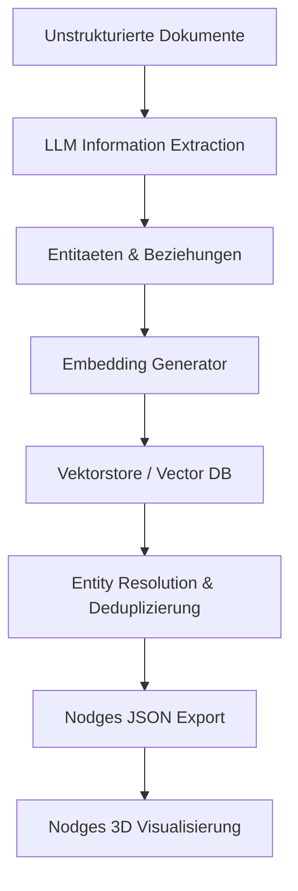

# Integration von Vektorstores und Knowledge Graphs in Nodges (GraphRAG)

Dieses Dokument beschreibt das Konzept, wie ein Vektorstore mit Hilfe eines LLMs befuellt werden kann, um anschliessend aus den strukturierten Daten ein kompatibles JSON fuer die 3D-Knowledge-Graph-Visualisierung in Nodges zu erstellen.

## 1. Das Konzept: Kombination von Vektor- und Graph-Datenbanken (GraphRAG)

Die Kombination von Vektorstores (fuer semantische Aehnlichkeits- und Volltextsuche) mit Knowledge Graphs (fuer explizite, strukturierte Beziehungen und Kontext) bildet die Grundlage fuer moderne **GraphRAG-Systeme** (Graph Retrieval-Augmented Generation).



---

## 2. Der detaillierte Workflow

### Schritt 1: Chunking & LLM-basierte Extraktion
*   **Input**: Rohtexte, PDF-Dokumente oder Web-Inhalte.
*   **LLM-Verarbeitung**: Ein LLM analysiert die Textabschnitte (Chunks) und extrahiert strukturierte Tripel: `(Subjekt, Praedikat, Objekt)` sowie Metadaten (Attribute der Entitaeten).
*   **Output**: Eine Liste von extrahierten Entitaeten und ihren Beziehungen.

### Schritt 2: Vektorisierung und Speicherung im Vektorstore
*   Jede extrahierte Entitaet und jede Beziehung (oder der zugrundeliegende Textabschnitt) wird ueber ein Embedding-Modell in einen hochdimensionalen Vektor umgewandelt.
*   Hierbei eignet sich das Modell **`google/gemini-embedding-2`** ueber OpenRouter besonders gut, da es multimodale Vektorraeume (Text und Bild) sowie flexible Ausgabedimensionen unterstuetzt.
*   Diese Vektoren werden zusammen mit den Metadaten (Namen, Typen, Quelltext-Referenzen) in einem Vektorstore (wie Pinecone, Qdrant, Milvus, Chroma oder pgvector) gespeichert.

#### Beispiel: Vektorgenerierung mit google/gemini-embedding-2 via OpenRouter
Hier ist ein Beispiel in TypeScript, wie das Embedding fuer einen Knoten generiert werden kann:

```typescript
async function generateEmbedding(text: string, apiKey: string): Promise<number[]> {
  const response = await fetch("https://openrouter.ai/api/v1/embeddings", {
    method: "POST",
    headers: {
      "Authorization": `Bearer ${apiKey}`,
      "Content-Type": "application/json",
      "HTTP-Referer": "https://github.com/Banixx/Nodges",
      "X-Title": "Nodges 3D Graph"
    },
    body: JSON.stringify({
      model: "google/gemini-embedding-2",
      input: text
    })
  });

  if (!response.ok) {
    throw new Error(`Embedding API Fehler: ${response.statusText}`);
  }

  const result = await response.json();
  return result.data[0].embedding; // Gibt das Vektor-Array zurueck (Standard: 768 Dimensionen)
}
```

### Schritt 3: Entity Resolution (Deduplizierung) via Vektor-Aehnlichkeit
Ein grosses Problem bei der automatisierten Graphenerstellung sind Duplikate (z.B. "LLM", "Large Language Model" und "Grosses Sprachmodell" beschreiben dasselbe Konzept).
*   **Loesung**: Durch die Abfrage von Kosinus-Aehnlichkeiten im Vektorstore koennen Entitaeten, deren Namen oder Beschreibungen semantisch sehr nah beieinander liegen, identifiziert werden.
*   **Konsolidierung**: Das LLM oder ein Algorithmus entscheidet, ob diese Knoten zusammengefuehrt werden. Dies bereinigt den Graphen vor der Visualisierung erheblich.

### Schritt 4: Generierung des Nodges JSON-Formats
Sobald die Daten im Vektorstore bereinigt und konsolidiert sind, werden sie in das Nodges-kompatible JSON-Schema exportiert.

---

## 3. Nodges JSON-Datenstruktur

Die exportierten Daten muessen folgendem Schema entsprechen, um in Nodges geladen und gerendert zu werden:

```json
{
  "dataModel": {
    "entityTypes": {
      "Concept": {
        "properties": {
          "description": { "type": "string" },
          "source": { "type": "string" }
        }
      }
    },
    "relationTypes": {
      "RELATED_TO": {
        "properties": {
          "weight": { "type": "number" }
        }
      }
    }
  },
  "visualMappings": {
    "entityMappings": {
      "Concept": {
        "color": "#4f46e5",
        "size": 1.5
      }
    },
    "relationMappings": {
      "RELATED_TO": {
        "color": "#94a3b8",
        "width": 1.0
      }
    }
  },
  "entities": [
    {
      "id": "e1",
      "type": "Concept",
      "name": "Vektorstore",
      "properties": {
        "description": "Datenbank zur Speicherung von Vektorbettungen.",
        "source": "Dokument_1"
      }
    },
    {
      "id": "e2",
      "type": "Concept",
      "name": "Knowledge Graph",
      "properties": {
        "description": "Netzwerk aus Entitaeten und ihren Beziehungen.",
        "source": "Dokument_2"
      }
    }
  ],
  "relationships": [
    {
      "id": "r1",
      "type": "RELATED_TO",
      "source": "e1",
      "target": "e2",
      "properties": {
        "weight": 0.85
      }
    }
  ]
}
```

---

## 4. Vorteile fuer das Nodges-Projekt

1.  **Semantisches Clustering**: Nodges kann die aehnlichsten Vektoren nutzen, um Knoten im 3D-Raum naeher beieinander zu positionieren (z.B. ueber benutzerdefinierte Koordinaten-Mappings).
2.  **Dynamischer Fokus**: Nutzer koennen im Frontend eine semantische Suche eingeben. Der Vektorstore liefert die relevantesten Knoten, und Nodges hebt diese und ihre Nachbarn im Graphen hervor.
3.  **Skalierbarkeit**: Durch das Auslagern grosser Datenmengen in den Vektorstore kann Nodges gezielt nur die Subgraphen visualisieren, die fuer die aktuelle Benutzerabfrage relevant sind.
