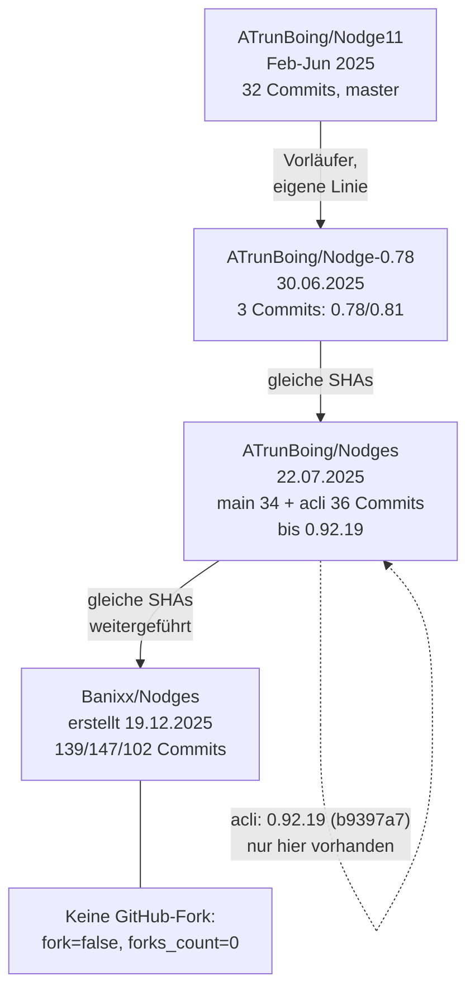
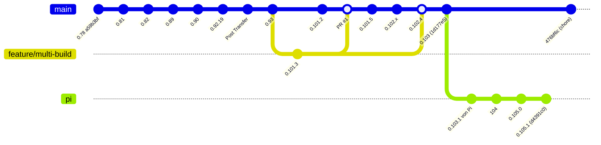
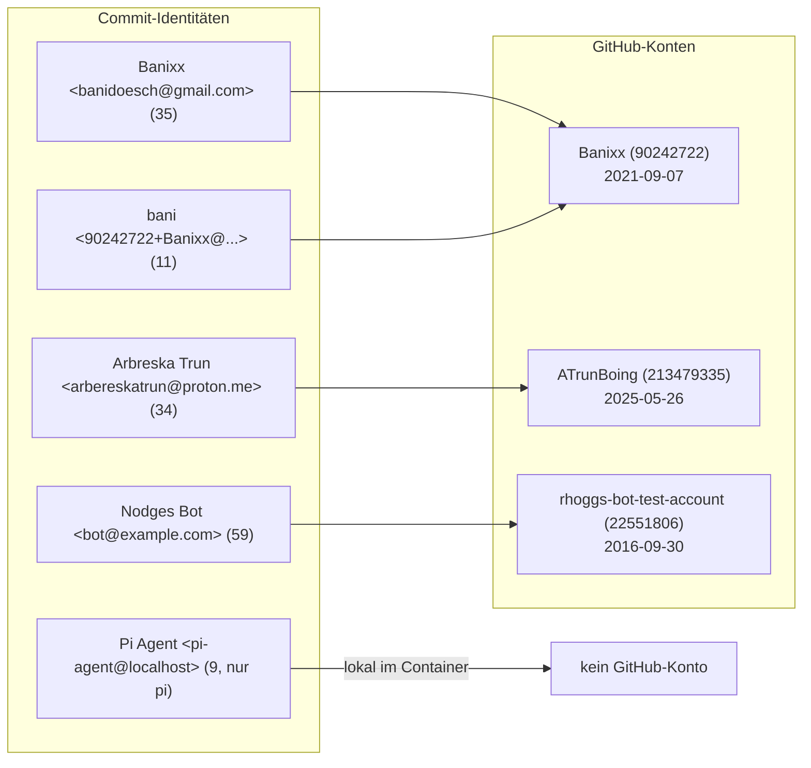
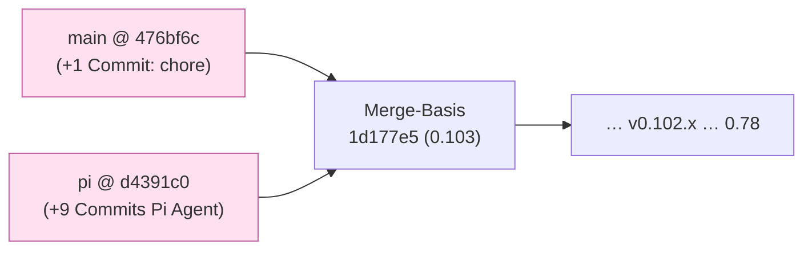

# Nodges – Git-Historie, Repositories, Forks und Branches

**Analyse-Bericht**
Stand: 2026-09-23, 20:01 UTC (Containerzeit)
Ort der Erhebung: Pi-Container, Arbeitsverzeichnis `/workspace`
Quellen: lokales Git-Repo (`/workspace/.git`), GitHub REST API (anonym via HTTPS), lokale Doku (`resetup.md`, `docs/`, `doc/`, `git-setup-bericht.md`, `Nodges_Pi/setup-pi-branch.sh`)

Ergänzende Übersichten: siehe `mmd/*.mmd` (gleiche Diagramme sind hier eingebettet).

---

## 0. Kurz-Zusammenfassung

- Es gibt **keine echte GitHub-Fork** (der technische "Fork"-Zähler ist bei allen Repositories `0`).
- Es existieren aber **vier zusammenhängende Repositories über zwei Konten** plus einen Bot-Account:
  - `Banixx/Nodges` (aktuelles Haupt-Repo, 2026)
  - `ATrunBoing/Nodges`, `ATrunBoing/Nodge-0.78`, `ATrunBoing/Nodge11` (Vorgänger/Parallel-Repos, 2025)
- `Banixx/Nodges` und `ATrunBoing/Nodges` teilen sich **identische Commit-Hashes** (gleiche SHA für dieselben Commits). Das beweist: dasselbe lokale Repository wurde in mehrere GitHub-Repos gepusht (Spiegel/Duplikate, keine getrennten Forks).
- Das aktuelle Arbeits-Repo im Container steht auf Branch **`pi`** (Commit `d4391c0`, "0.105.1"). Branch `main` (Remote `476bf6c`) und `pi` haben sich **getrennt entwickelt**: `pi` ist 9 Commits voraus und 1 Commit hinter `main`.
- **Kein Tag, kein Release** im Haupt-Repo. Versionierung läuft ausschließlich über Commit-Nachrichten und `package.json`.
- **SSH-Push ist derzeit kaputt** (Host-Key-Verifikation schlägt fehl), HTTPS-Token-Speicher ist leer. Details in Abschnitt 7.

Direkte Antwort auf die Kernfrage "welche Forks existieren?": **keine.**

---

## 1. Die Repositories

| Repository | Owner | erstellt | letzter Push | Commits (Default-Branch) | Default | Forks | Sterne | Branches |
|---|---|---|---|---|---|---|---|---|
| `Banixx/Nodges` | Banixx | 2025-12-19 17:26 UTC | 2026-09-22 08:19 UTC | 139 (`main`) / 147 (`pi`) / 102 (`feature/multi-build`) | `main` | **0** | 0 | `main`, `pi`, `feature/multi-build` |
| `ATrunBoing/Nodges` | ATrunBoing | 2025-07-22 20:27 UTC | 2025-11-23 08:20 UTC | 34 (`main`) / 36 (`acli`) | `main` | **0** | 0 | `main`, `acli` |
| `ATrunBoing/Nodge-0.78` | ATrunBoing | 2025-06-30 15:40 UTC | 2025-07-01 12:26 UTC | 3 (`master`) | `master` | **0** | 0 | `master` |
| `ATrunBoing/Nodge11` | ATrunBoing | 2025-06-06 08:47 UTC | 2025-06-06 12:30 UTC | 32 (`master`) | `master` | **0** | 0 | `master` |

Weitere Details zu `Banixx/Nodges`:

- Sichtbarkeit: `public`
- Lizenz: MIT
- GitHub-Pages-Homepage laut API-Metadaten: `https://banixx.github.io/Nodges/` (liefert HTTP 200)
- Beschreibung: *keine* gesetzt
- Offene Issues: 0
- Pull Requests gesamt: 1 (siehe Abschnitt 5)

Weitere Repos der beiden Konten (nicht Teil der Nodges-Historie):

| Konto | Repo | Rolle |
|---|---|---|
| Banixx | `simplemdmmd` | anderes Projekt (Mermaid/MD), letzter Push 2026-02-18 |
| Banixx | `Gumpi` | anderes Projekt, letzter Push 2025-06-10 |
| ATrunBoing | – | nur die drei Nodges-Vorgänger-Repos |

---

## 2. Konten und Identitäten (wer committet)

| Identität | GitHub-Konto | Anzeigename | E-Mail im Commit | erstellt | Rolle |
|---|---|---|---|---|---|
| Autor (Konto 1) | `Banixx` (ID 90242722) | bani | `banidoesch@gmail.com` | 2021-09-07 | Haupt-Autor 2025/2026 |
| Autor (Konto 2) | `ATrunBoing` (ID 213479335) | – | `arbereskatrun@proton.me` | 2025-05-26 | früher Autor ("Arbreska Trun") |
| Bot | `rhoggs-bot-test-account` (ID 22551806) | – | `bot@example.com` | 2016-09-30 | committet als "Nodges Bot" |
| Container-Agent | – (lokal) | Pi Agent | `pi-agent@localhost` | – | Container-Commits 2026 |

Hinweise zu den Identitäten:

- GitHub ordnet die Commit-Autoren den Konten zu: Die 59 "Nodges Bot"-Commits werden dem Konto `rhoggs-bot-test-account` zugerechnet, die 34 "Arbreska Trun"-Commits dem Konto `ATrunBoing`.
- `ATrunBoing` und `Banixx` sind zwei Konten derselben Person (gleiche Vorgänger-Historie, gleiche Commit-Objekte). Der Name "bani"/"Banixx" und der frühere Autorname "Arbreska Trun" gehören zusammen.
- `Pi Agent <pi-agent@localhost>` ist **kein** GitHub-Konto, sondern die lokale Identität im Container (`/home/.pi/gitconfig`).

Commit-Autoren-Verteilung im Haupt-Repo (Branch `main`, 139 Commits):

| Autor | Commits |
|---|---|
| Nodges Bot (`bot@example.com`, Konto `rhoggs-bot-test-account`) | 59 |
| Banixx (`banidoesch@gmail.com`) | 35 |
| Arbreska Trun (`arbereskatrun@proton.me`, Konto `ATrunBoing`) | 34 |
| bani (`90242722+Banixx@users.noreply.github.com`) | 11 |
| **Summe `main`** | **139** |
| Pi Agent (`pi-agent@localhost`, nur Branch `pi`) | 9 |
| **Summe `pi`** | **147** |

---

## 3. Historie und Zeitleiste

Die Historie beginnt **vor** der Erstellung des Haupt-Repos: Der erste Commit (`0.78`) ist vom 2025-06-30, das GitHub-Repo `Banixx/Nodges` wurde erst am 2025-12-19 angelegt. Das Haupt-Repo wurde also mit bereits vorhandener Historie neu erstellt (Push einer gewachsenen lokalen Kopie).

Phasen:

| Zeitraum | Repo(s) | Inhalt |
|---|---|---|
| Feb – Jun 2025 | `ATrunBoing/Nodge11` | früher Vorläufer ("Initial commit", "oneCline", "zwei/drue/vier", dann Versionen bis 0.92-Kontext) |
| 30.06. – 01.07.2025 | `ATrunBoing/Nodge-0.78` | Start von "Nodges" (0.78, second, 0.81) |
| 01.07. – 30.09.2025 | `ATrunBoing/Nodges` | Hauptentwicklung: 0.82, 0.89, 0.90, 0.92.x (Branch `main` und `acli`) |
| Sep – Nov 2025 | `ATrunBoing/Nodges` (`acli`) | 0.92.17 – 0.92.19 |
| 24.11.2025 | (Übergang) | Commit "Post Transfer" `c2ec040` |
| 25.11. – 19.12.2025 | `Banixx` lokal / neues Repo | 0.93, 0.94, 0.95, 0.97, Deploy-Workflow eingerichtet, Repo `Banixx/Nodges` neu angelegt (19.12.2025) |
| Jan – Mär 2026 | `Banixx/Nodges` | 0.97.x, 0.98.x, Dev-Panel, DevContainer-GPU |
| Mai – Jun 2026 | `Banixx/Nodges` | 0.100, 0.101.x, Branch `feature/multi-build`, PR #1 (Merge) |
| Jul 2026 | `Banixx/Nodges` | 0.102.x (viele Patch-Commits, Build 5, "first openening", Deploy-Versuche) |
| Aug – Sep 2026 | `Banixx/Nodges`, Branch `pi` | 0.103, 0.103.1 (Pi), 0.104, 0.105.x, LightRAG im Container |

Wichtige Einzel-Commits im Container-Repo (`pi`):

| Commit | Datum | Autor | Nachricht |
|---|---|---|---|
| `5b355b9` | 2026-08-10 | Pi Agent | 0.103.1 von Pi |
| `91138a5` | 2026-08-29 | Pi Agent | 104 |
| `cfe5658` | 2026-08-31 | Pi Agent | zwütschged |
| `d8bef5b` | 2026-09-16 | Pi Agent | 0.105.0 |
| `2e44e67` | 2026-09-16 | Pi Agent | 0.105.1 |
| `346d9c2` | 2026-09-17 | Pi Agent | 0.105- züglete |
| `2b3a97b` | 2026-09-17 | Pi Agent | key restriction |
| `10d6c50` | 2026-09-17 | Pi Agent | LightRAG im Container, Setup-Doku aktualisiert |
| `d4391c0` | 2026-09-22 | Pi Agent | 0.105.1 (HEAD) |

Versions-Sprünge (Auszug): 0.78 → 0.81 → 0.82 → 0.89 → 0.90 → 0.92.19 → 0.93 → 0.94 → 0.95 → 0.97 → 0.98.x → 0.100 → 0.101.x → 0.102.x → 0.103 → 0.104 → 0.105.0 → 0.105.1 → (package.json) 0.105.2.

---

## 4. Branches

| Branch | Repo | Tip-Commit | Zweck |
|---|---|---|---|
| `main` | `Banixx/Nodges` | `476bf6c` (Remote) / `1d177e5` (lokaler Stand) | stabiler Zweig; Deploy-Ziel für GitHub Pages |
| `pi` | `Banixx/Nodges` | `d4391c0` | aktiver Entwicklungsbranch des Containers |
| `feature/multi-build` | `Banixx/Nodges` | `ec2109d` | Feature-Zweig "Multi-Build"; zweimal in `main` gemergt |
| `main` | `ATrunBoing/Nodges` | `5b5174e` | Vorgänger-Hauptzweig |
| `acli` | `ATrunBoing/Nodges` | `b9397a7` | Vorgänger-Zweig (0.92.19, Nov 2025) |
| `master` | `ATrunBoing/Nodge-0.78` | `22c44ef` | Vorläufer |
| `master` | `ATrunBoing/Nodge11` | `003120b8` | Vorläufer |
| `help`, `hrlp` | `/workspace` (lokal) | – | existieren **nur** im lokalen Reflog, keine aktuellen Refs (Branch-Experimente, gelöscht/umbenannt) |

Lokaler Reflog-Spur: `checkout: moving from help to pi`, `moving from hrlp to help` usw. Die Branches `help`/`hrlp` hatten keinen eigenen Commit und wurden nicht gepusht.

Merge-Commits (5 gesamt):

| Commit | Datum | Beschreibung |
|---|---|---|
| `cf384fa` | 2025-11-26 | Merge branch 'main' (lokale/Remote-Angleichung) |
| `20a337a` | 2026-01-10 | Merge branch 'main' (mobil via GitHub aktualisiert) |
| `e4e3474` | 2026-05-11 | Merge branch 'main' |
| `c30db8f` | 2026-06-29 | Merge pull request #1 (`feature/multi-build` → `main`) |
| `bfc0db8` | 2026-07-08 | Merge branch 'feature/multi-build' (zweiter Merge) |

Pull Request #1: "Feature/multi build", `feature/multi-build` → `main`, gemergt am 2026-06-29 09:51 UTC durch `Banixx`. Es ist der einzige PR im Repo.

---

## 5. Der aktuelle Stand (Arbeits-Repo `/workspace`)

```
Branch:        pi  (trackt origin/pi)
HEAD:          d4391c0  "0.105.1"  (2026-09-22 08:18 UTC, Pi Agent)
package.json:  0.105.2  (im HEAD und im Arbeitsverzeichnis)
Merge-Basis:   1d177e5  ("0.103", letzter gemeinsamer Commit von main und pi)
```

Abweichungen (`git status`):

- **Geändert (nicht committet):** `src/utils/LLMService.ts` (+18 / −2 Zeilen)
- **Untracked:** `blau.txt` (Inhalt "himmelblau"), `hrlp.txt` (Inhalt "hrrlp"), `git-setup-bericht.md`, `testdata/` (`buddenbrooks.txt`, `Nodges_ErrorLog_01_23_1235.json`, `prompt_bb.txt`, teils mit `:Zone.Identifier`-Beidateien)

Verhältnis `pi` ↔ `main` (lokal):

- `pi` ist **9 Commits voraus** von `main` (die Pi-Commits von `5b355b9` bis `d4391c0`).
- `pi` ist **0 Commits hinter** dem lokalen `main` (`1d177e5`).
- Gegenüber dem **Remote**-`main` (`476bf6c`) ist `pi` jedoch **1 Commit hinter** (`476bf6c` fehlt in `pi`).

→ `main` und `pi` sind damit **auseinandergelaufen** (divergiert): je eigener Commit, gemeinsamer Vorfahr `1d177e5`.

Remote-Stände (via GitHub API / anonymes `ls-remote`):

```
refs/heads/feature/multi-build  ec2109d0caee83602c2bd42c8e9d216ffabf3f5f
refs/heads/main                 476bf6c1b115f86dfc7e1be98ffbc6f169822454
refs/heads/pi                   d4391c01546c3d5123bcbdb0999ac505f61dea41
```

Der zusätzliche Remote-Commit auf `main`:

```
476bf6c  2026-09-22 07:16 UTC  bani  "chore: stop tracking .tmp.driveupload and add to gitignore"
```

Lokale Refs sind also **veraltet** (lokaler `origin/main` zeigt noch auf `1d177e5`), weil der letzte `git fetch` fehlschlug.

Nicht vorhanden: **Tags (0), Releases (0), Stashes (0), Notes (0), Submodule (0), zusätzliche Worktrees (1: nur `/workspace`).**

---

## 6. Forks – vollständige Prüfung

| Prüfung | Ergebnis |
|---|---|
| `forks_count` in `Banixx/Nodges` | 0 |
| `forks_count` in `ATrunBoing/Nodges`, `Nodge-0.78`, `Nodge11` | je 0 |
| `forks_count` in `simplemdmmd`, `Gumpi` | je 0 |
| GitHub-Fork-Liste `Banixx/Nodges` | leer |
| GitHub-Suche "Nodges fork:only" | nur fremde Treffer (`yii-lily` usw.), keine Nodges-Fork |
| Suche nach Repos mit Namen "Nodges" | 7 Treffer, keiner ist eine Fork von `Banixx/Nodges` |

**Ergebnis: Es existiert keine GitHub-Fork von Nodges.**

Was es *stattdessen* gibt, ist eine **Repo-Familie** (Duplikate über Konten hinweg). Wegen identischer Commit-Hashes ist das eine Kopie/Spiegelung derselben lokalen Historie:

- `Banixx/Nodges` enthält u. a. die Commits `a59b3bf`, `5ae8860`, `22c44ef`, `70bba30`, `a38c096`, `0713001`, `5b5174e`, `fefce310` – **dieselben SHAs** wie in `ATrunBoing/Nodges` bzw. `Nodge-0.78`.
- `ATrunBoing/Nodges` hat zusätzlich den exklusiven Branch `acli` mit `b9397a7` (0.92.19), der in `Banixx/Nodges` **nicht** vorkommt.
- `ATrunBoing/Nodge11` (Feb–Jun 2025) ist eine **eigene, nicht verbundene** Vorgänger-Linie (Commits wie `a88d7a78` "Initial commit" sind in `Banixx/Nodges` nicht enthalten).

---

## 7. Wie committet und gepusht wird

### 7.1 Drei Arbeitsumgebungen, ein Remote

Laut Doku und Git-Konfiguration gibt es drei Orte, an denen gearbeitet wird:

| Ort | Pfad | Rolle |
|---|---|---|
| GitHub | `github.com/Banixx/Nodges` | zentraler Austauschpunkt |
| Windows-Host | `C:\Users\ich\Desktop\code\_projects\Nodges` | Windows-Arbeitskopie (lokal, mit GitHub verbunden) |
| Windows-Host | `C:\Users\ich\Desktop\code\_projects\Nodges_Pi` | Compose-Projekt (startet den Pi-Container) |
| WSL-Host | `/home/unixusername/nodges` (`\\wsl.localhost\Ubuntu\...`) | Repo, das in den Container gemountet wird |
| Container | `/workspace` | **dieselbe** Arbeitskopie wie das WSL-Repo, eigenes `.git` |

Wichtig: `/workspace` und `/home/unixusername/nodges` sind **dasselbe Verzeichnis** (Bind-Mount). Der Ordner `/workspace/Nodges_Pi` ist nur ein Git-Snapshot (16 getrackte Dateien) des echten Compose-Ordners und hat **kein eigenes `.git`**.

Die Windows-Pfade sind im Container **nicht erreichbar** (kein `/mnt`, geprüft). Aussagen dazu stammen aus `resetup.md` und `docs/setup-arbeitsuebergabe.md`.

### 7.2 Git-Identität im Container

`/home/.pi/gitconfig` (per `GIT_CONFIG_GLOBAL` gesetzt):

```
[user]
    name = Pi Agent
    email = pi-agent@localhost
[credential]
    username = Banixx
    helper = store --file /home/.pi/git-credentials
```

Diese Datei wird beim Containerstart vom Compose-`command` erzeugt (`docker-compose.yml`).

### 7.3 Push-Wege und ihr aktueller Zustand

- Remote-URL: `git@github.com:Banixx/Nodges.git` (**SSH**, fetch + push).
- **SSH schlägt aktuell fehl:** `Host key verification failed`. Ursache: `HOME=/home/piuser`, aber SSH-Key und SSH-Config liegen unter `/home/.pi/.ssh/` (dorthin gemountet). Es gibt keine `known_hosts`.
  - Vorhandene Dateien: `/home/.pi/.ssh/config` (mit `StrictHostKeyChecking no`, `UserKnownHostsFile /dev/null`), `/home/.pi/.ssh/id_ed25519` + `.pub`. Diese Config greift aber nicht, weil SSH sie unter `$HOME/.ssh` sucht.
  - Öffentlicher Schlüssel: `ssh-ed25519 AAAAC3NzaC1lZDI1NTE5AAAAIK+XRJDMSmitN57PowUq4I+iV+vm/6dBWl8lB1QluS5f pi-agent@localhost`
- HTTPS-Credential-Speicher `/home/.pi/git-credentials` ist **leer (0 Byte)** → kein gespeicherter Token. Compose füllt ihn nur, wenn `GITHUB_TOKEN` in der `.env` gesetzt ist.
- Anonymes **Lesen per HTTPS funktioniert** (`git ls-remote https://github.com/Banixx/Nodges.git` liefert die Branches).
- Der lokale Reflog zeigt, dass Pushes früher **funktioniert** haben (`update by push` für `origin/pi`, 2026-08 bis 2026-09).

### 7.4 Wer wann committet hat (Muster)

- Der Windows-Host committet unter den Namen `Nodges Bot` (Konto `rhoggs-bot-test-account`, 59 Commits) und `Banixx`/`bani` (46 Commits). Das erklärt den automatisch wirkenden Charakter vieler Commit-Nachrichten (nur Versionsnummern).
- Der Container committet als `Pi Agent` auf Branch `pi`.
- GitHub-Events (letzte 7) zeigen durchweg `PushEvent` durch `Banixx` – das entspricht den letzten Pushes auf `origin/pi` und `origin/main`.

---

## 8. CI/CD und Deploy

Workflow-Datei: `.github/workflows/deploy.yml` ("Deploy Vite to Pages")

- Trigger: Push auf `main` + manuell (`workflow_dispatch`)
- Schritte: checkout → Node 20 → `npm ci` → `npm run build --if-present` → `upload-pages-artifact (./dist)` → `deploy-pages@v4`
- Repo-Workflows laut API: `deploy.yml`, `Dependency Graph`, `pages-build-deployment`

Ergebnis:

- **38 erfolgreiche** Deploys, letzter Erfolg **2026-07-15 18:50 UTC**.
- Ab **2026-07-19** schlagen die Deploys **fehl**; letzter fehlgeschlagener Lauf auf `main`: 2026-09-22 07:16 UTC (und auf `feature/multi-build`: 2026-09-22 11:43 UTC).
- Fehlerstelle im Job: Schritt `npm run build --if-present` (Failure), Deploy-Job wird übersprungen.
- Die GitHub-Pages-Seite `https://banixx.github.io/Nodges/` antwortet trotzdem mit **HTTP 200** – sie steht noch auf dem letzten erfolgreichen Deployment (Juli 2026).
- **Keine Releases/Tags** vorhanden; Veröffentlichung läuft also ausschließlich über Pages.

---

## 9. Ordner-Chronik (Windows / WSL / Container)

| Pfad | Umgebung | Zweck | Zugriff aus Container |
|---|---|---|---|
| `C:\Users\ich\Desktop\code\_projects\Nodges` | Windows | Arbeitskopie; früher Sitz der Windows-LightRAG-Instanz | **nicht erreichbar** |
| `C:\Users\ich\Desktop\code\_projects\Nodges_Pi` | Windows | kanonisches Compose-Projekt (`docker-compose.yml`, `start_pi_container.cmd`, `.env`) | **nicht erreichbar** |
| `\\wsl.localhost\Ubuntu\home\unixusername\nodges` | WSL | Repo-Quelle, in Container gemountet | identisch mit `/workspace` |
| `/workspace` | Container | Arbeitskopie mit eigenem `.git` | ja |
| `/workspace/Nodges_Pi` | Container | Git-Snapshot des Compose-Ordners (16 getrackte Dateien, kein `.git`) | ja |
| `/home/.pi` | Container (persistent) | Pi-Home, Git-Config, SSH-Key, `git-credentials` | ja |

Laut `resetup.md`:

- Der Windows-Ordner `..._projects\Nodges` wird **für das Backend nicht mehr gebraucht**, seit LightRAG im Container läuft.
- `..._projects\Nodges_Pi` bleibt der Ort, an dem `docker compose` ausgeführt wird; Änderungen an `docker-compose.yml`/`start_pi_container.cmd` müssen aus dem Repo dorthin kopiert werden.

---

## 10. Befunde, Risiken, offene Punkte

1. **SSH-Push defekt:** `Host key verification failed`, weil `$HOME=/home/piuser` und SSH-Dateien unter `/home/.pi/.ssh`. Ohne Fix können aus dem Container keine SSH-Pushes mehr erfolgen.
2. **HTTPS-Credential leer:** `/home/.pi/git-credentials` ist 0 Byte. HTTPS-Push würde nach Benutzer/Tokens fragen (oder scheitern).
3. **Veraltete Remote-Refs:** Lokales `origin/main` zeigt noch `1d177e5`; tatsächlich ist Remote-`main` bei `476bf6c`.
4. **Divergenz `main` ↔ `pi`:** `main` hat 1 Commit (`476bf6c`), den `pi` nicht hat; `pi` hat 9 Commits, die `main` nicht hat. Ein Merge/PR ist nötig, soll `main` den Pi-Stand erhalten.
5. **Deploy seit 2026-07-19 kaputt:** `npm run build` schlägt im CI fehl; die Pages-Seite ist veraltet.
6. **Uncommittete Änderung** `src/utils/LLMService.ts` (+ untracked Dateien) – muss bewusst committet oder verworfen werden.
7. **Spiegel-Repos können auseinanderlaufen:** `ATrunBoing/Nodges` (`acli`, 0.92.19) enthält einen Stand, der im Haupt-Repo fehlt. Nur bei Bedarf als Archiv betrachten.
8. **Lokale Reflog-Branches** `help`/`hrlp` existieren nur noch als Reflog-Spur; keine Ref, kein Remote.

---

## 11. Anhang: Mermaid-Übersichten

Die folgenden Diagramme liegen zusätzlich als `.mmd`-Dateien in `mmd/`.

### 11.1 Repo-Topologie (Arbeitsumgebungen → GitHub)

```mermaid
flowchart LR
    subgraph WIN["Windows-Host"]
        W1["C:\\...\\_projects\\Nodges<br/>Windows-Arbeitskopie"]
        W2["C:\\...\\_projects\\Nodges_Pi<br/>Compose-Projekt (kanonisch)"]
    end
    subgraph WSL["WSL-Host"]
        W3["/home/unixusername/nodges"]
    end
    subgraph CTR["Pi-Container"]
        C1["/workspace (git)"]
        C2["/workspace/Nodges_Pi<br/>Git-Snapshot, kein .git"]
        C3["/home/.pi<br/>gitconfig + ssh + credentials"]
    end
    G["GitHub<br/>Banixx/Nodges"]
    W1 -->|git push/pull| G
    W3 -.->|Bind-Mount, dasselbe Verzeichnis| C1
    W2 -.->|startet| CTR
    C1 -->|git push/pull (SSH, aktuell defekt)| G
    C2 -.->|"Kopie von W2 (manuell)"| W2
```

### 11.2 Repo-Vererbung / Historie (gleiche Commit-Hashes)



### 11.3 Branch-Graph des Haupt-Repos



### 11.4 Konten und Commit-Zuordnung



### 11.5 Ablauf: wie ein Commit entsteht und ankommt

```mermaid
sequenceDiagram
    participant W as Windows-Host
    participant G as GitHub (Banixx/Nodges)
    participant C as Pi-Container (/workspace)
    W->>W: arbeiten, git commit (Banixx / Nodges Bot)
    W->>G: git push (main / feature/multi-build)
    G-->>G: Actions "Deploy Vite to Pages"
    G-->>G: Pages-Deployment (seit 2026-07-19 fehlerhaft)
    C->>C: arbeiten, git commit (Pi Agent, Branch pi)
    C--xG: git push (SSH) -- aktuell FEHLER: Host key verification failed
    W->>G: git pull / PR (main)
    Note over C,G: Sync nur über GitHub; kein direkter Kontakt Host<->Container
```

### 11.6 Ist-Stand der Branches (`main` vs. `pi`)



---

## 12. Methodik und Grenzen

- Lokale Daten vollständig aus `/workspace/.git` (Refs, Reflog, Logs, Config, packed-refs).
- Remote-Daten über die öffentliche GitHub-REST-API (anonyme Anfragen). Das anonyme Rate-Limit (60 Anfragen/Stunde) wurde am Ende der Analyse erreicht; die verbleibenden Lücken sind:
  - Die vollständigen `contributors`-Listen der Vorgänger-Repos (nur teilweise abgefragt).
  - Ob der öffentliche Schlüssel `pi-agent@localhost` als Deploy-Key am Repo hinterlegt ist.
- Windows-Pfade (`C:\...`) sind aus dem Container nicht lesbar; deren Beschreibung stammt aus `resetup.md`, `docs/setup-arbeitsuebergabe.md` und `git-setup-bericht.md`.
- Die Diagramme sind Momentaufnahmen vom 2026-09-23; Remote-Refs müssen vor Änderungen per `git fetch` neu geprüft werden.

---

*Ende des Berichts.*
