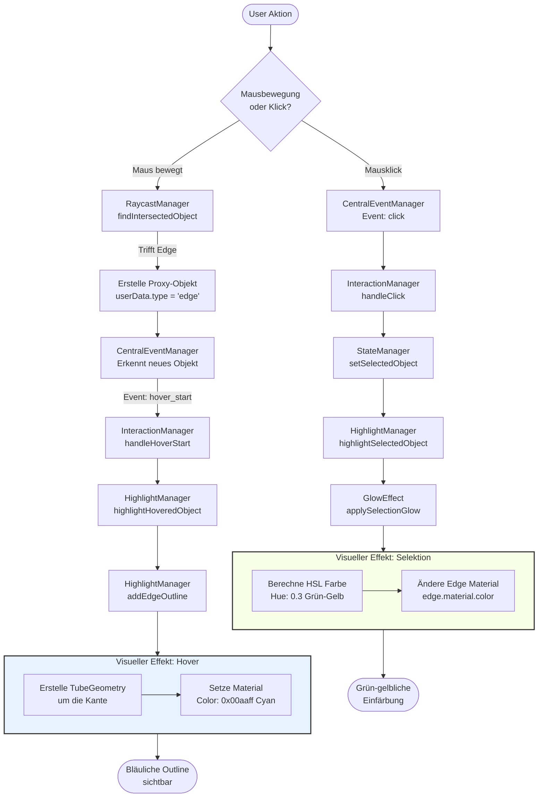

# Analyse der Edge-Interaktionen

Dieses Dokument erläutert die technischen Abläufe beim Hovern und Klicken auf Kanten (Edges) im System. Es bezieht sich auf die visuelle Darstellung im Sequenzdiagramm und ergänzt diese um ein detailliertes Flussdiagramm.

## Erläuterung zum Sequenzdiagramm

Das Sequenzdiagramm visualisiert den zeitlichen Ablauf der Methodenaufrufe zwischen den verschiedenen Managern. Hier sind die wichtigsten technischen Details zu den einzelnen Schritten:

### 1. Raycasting & Proxy-Objekte
Da Edges oft als `InstancedMesh` (für Performance) gerendert werden, kann man nicht direkt auf das einzelne Mesh zugreifen wie bei normalen Objekten.
*   **RaycastManager:** Erkennt, welche Instanz getroffen wurde (`instanceId`).
*   **Proxy-Objekt:** Er erstellt ein temporäres `THREE.Object3D` (Dummy), das die Daten der spezifischen Kante enthält (`userData`). Dieses Proxy-Objekt wird durch das System gereicht.

### 2. Event-Verteilung
Der `CentralEventManager` fungiert als zentrale Schaltstelle. Er entkoppelt die Eingabeerkennung von der Logik.
*   Er prüft kontinuierlich auf Änderungen unter der Maus.
*   Wenn sich das Objekt ändert, feuert er `hover_start` oder `hover_end`.
*   Bei Mausklicks feuert er `click`.

### 3. Visuelle Effekte (HighlightManager & GlowEffect)
Hier unterscheidet sich die Behandlung von Hover und Klick fundamental:

*   **Hover (Blau/Cyan):**
    *   Es wird **keine** Materialfarbe geändert.
    *   Stattdessen erzeugt `HighlightManager.addEdgeOutline()` eine **neue Geometrie**: Eine Röhre (`TubeGeometry`), die etwas dicker ist als die Kante selbst.
    *   Diese Röhre bekommt ein eigenes Material in Cyan (`0x00aaff`).
    *   *Vorteil:* Funktioniert auch bei InstancedMeshes perfekt, ohne den gesamten Batch neu berechnen zu müssen.

*   **Klick / Selektion (Grün-Gelb):**
    *   Hier wird die **Farbe der Kante selbst** verändert.
    *   Der `GlowEffect` berechnet eine neue Farbe basierend auf HSL-Werten.
    *   `Hue: 0.3` entspricht dem grün-gelblichen Ton.
    *   Dies signalisiert einen dauerhaften Status ("Selektiert").

---

## Flussdiagramm der Logik

Das folgende Diagramm zeigt die Entscheidungswege im Code, wenn eine Interaktion stattfindet.



---

## Technische Details zu den Farbwerten

### Hover-Farbe (Cyan/Blau)
```javascript
// HighlightManager.js, Zeile 179
const outlineMaterial = new THREE.MeshBasicMaterial({
    color: 0x00aaff,  // RGB: (0, 170, 255)
    transparent: true,
    opacity: 0.8
});
```

**Hex-Wert:** `0x00aaff`
- **R:** 0 (0%)
- **G:** 170 (66.7%)
- **B:** 255 (100%)
- **Ergebnis:** Ein helles, leuchtendes Cyan/Blau

### Selektions-Farbe (Grün-Gelb)
```javascript
// GlowEffect.js, Zeile 108-112
this.applyEdgeGlow(object, 0.8, {
    hue: 0.3,           // 0.3 * 360° = 108° (Grün-Gelb)
    saturation: 1,      // 100% Sättigung
    baseIntensity: 0.5,
    maxIntensity: 0.9
});
```

**HSL-Wert:** `(0.3, 1.0, ~0.7)`
- **Hue:** 0.3 = 108° auf dem Farbkreis (zwischen Grün bei 120° und Gelb bei 60°)
- **Saturation:** 1.0 = Vollständig gesättigt
- **Lightness:** Zwischen 0.5 und 0.9 (abhängig von der Intensität)

---

## Wichtige Code-Dateien

| Datei | Verantwortlichkeit |
|-------|-------------------|
| `RaycastManager.ts` | Erkennung von Objekten unter der Maus, Erstellung von Proxy-Objekten |
| `CentralEventManager.ts` | Event-Verteilung (hover_start, hover_end, click) |
| `InteractionManager.ts` | Verarbeitung von User-Interaktionen, Koordination |
| `HighlightManager.js` | Verwaltung aller Highlight-Effekte, Outline-Erstellung |
| `GlowEffect.js` | Farbmanipulation für Glow- und Selektionseffekte |
| `StateManager.ts` | Verwaltung des Anwendungszustands (selectedObject, hoveredObject) |

---

## Zusammenfassung

Die Edge-Interaktionen nutzen zwei unterschiedliche visuelle Strategien:

1. **Hover:** Additive Geometrie (Outline) in Cyan - temporär und nicht-invasiv
2. **Selektion:** Direkte Materialänderung in Grün-Gelb - persistent bis zur Deselektierung

Diese Trennung ermöglicht es, beide Effekte gleichzeitig anzuzeigen und klar zwischen temporären (Hover) und dauerhaften (Selektion) Zuständen zu unterscheiden.
