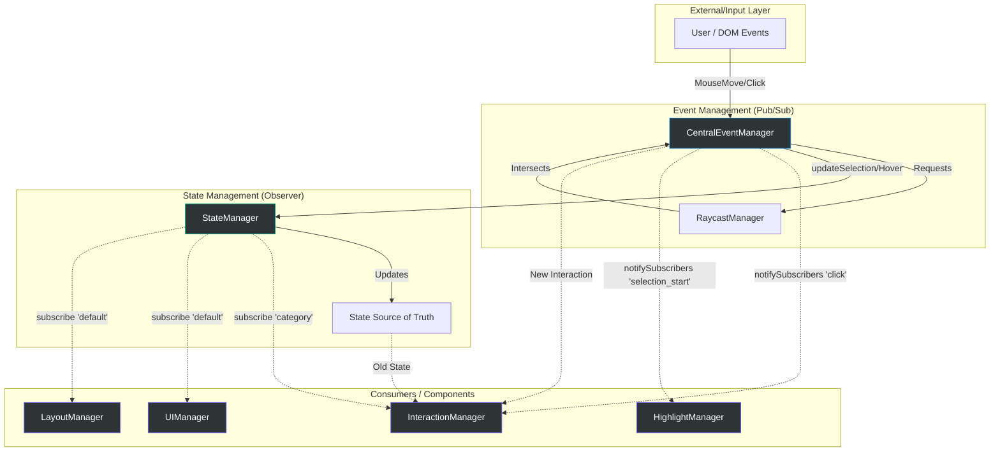

# Architektur: Das doppelte Eventsystem in Nodges

In der aktuellen Architektur von Nodges existieren zwei parallele Systeme zur Handhabung von Interaktionen und Zustandsänderungen. Dies führt zu einer "dualen" Struktur, die zwar flexibel ist, aber auch Redundanzen und Synchronisationsrisiken birgt.

## Visualisierung der Event-Struktur

## Definition der Systeme

### 1. CentralEventManager (Pub/Sub)

* **Zuständigkeit:** Erfassung von DOM-Events, Raycasting zur Objekterkennung.
* **Muster:** Publish/Subscribe.
* **Vorteil:** Entkoppelt die Hardware-Events (Maus/Tastatur) von der Fachlogik.
* **Beispiel:** `centralEventManager.publish('click', { clickedObject })`.

### 2. StateManager (Observer)

* **Zuständigkeit:** Hält den "Source of Truth" der Applikation.
* **Muster:** Observer (Klassischer State-Update-Mechanismus).
* **Vorteil:** Zentrale Stelle für den aktuellen Zustand (Selektion, Hover, Tools).
* **Beispiel:** `stateManager.subscribe(state => updateVisuals(state))`.

---

## Warum "Doppelt"?

Die Systeme sind eng miteinander verwoben:

1. **CEM aktualisiert SM:** Wenn der `CentralEventManager` einen Hover erkennt, ruft er direkt `stateManager.setHoveredObject()` auf.
2. **Parallele Benachrichtigung:** Ein Manager (wie der `InteractionManager`) hört oft auf den `CentralEventManager` für den präzisen Klick-Zeitpunkt, liest aber gleichzeitig den Zustand aus dem `StateManager`.

> [!WARNING]
> **Synchronisationsrisiko:** Es kann passieren, dass ein Pub/Sub-Event vom CEM gefeuert wird, bevor der State im SM vollständig propagiert wurde (oder umgekehrt). Dies führt zu schwer debuggbaren "Stale State"-Fehlern.

## Empfehlung

Langfristig sollte eines der Systeme als primärer Taktgeber fungieren. Da der `StateManager` bereits das UI (DOM/WebGL) synchronisiert, wäre es sinnvoll, den `CentralEventManager` als reinen "Input-Parser" zu nutzen, der den State aktualisiert, woraufhin alle anderen Komponenten ausschließlich auf State-Änderungen reagieren.
