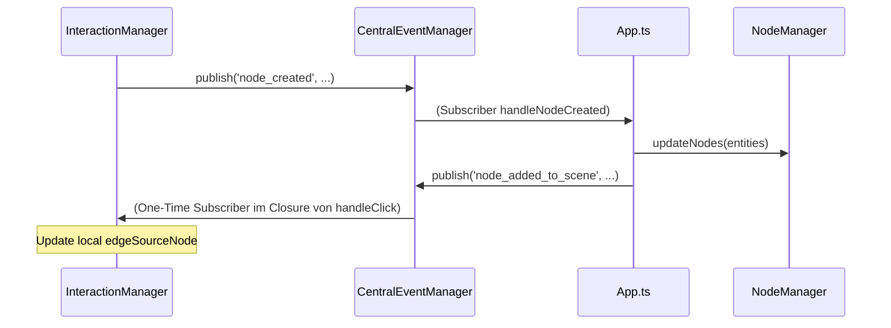

# Deep Dive: Redundanzen und Risiken im doppelten Eventsystem

Diese Analyse zeigt konkrete Stellen im Code von Nodges, an denen die Koexistenz von `CentralEventManager` (CEM) und `StateManager` (SM) zu Redundanz und potenziellen Fehlern führt.

## 1. Redundante Trigger-Ketten

Ein klassisches Beispiel findet sich in der Interaktion zwischen `InteractionManager` und `HighlightManager`.

### Der Ablauf bei einem Klick

1. **`CentralEventManager.handleClick`**: Registriert den Klick und ruft `notifySubscribers('click', ...)` auf.
2. **`InteractionManager.handleClick`**: Empfängt das Event und ruft `this.selectObject(clickedObject)` auf.
3. **`InteractionManager.selectObject`**:
    * Ruft `this.stateManager.setSelectedObject(object)` auf.
    * **Redundanz:** Ruft zusätzlich manuell `this.highlightManager.updateHighlights(this.stateManager.state)` auf.

**Warum das problematisch ist:**
Der `HighlightManager` hat im Konstruktor bereits den `StateManager` abonniert:

```typescript
// HighlightManager.ts:61
this.stateManager.subscribe(this.handleStateChange.bind(this), 'highlight');
```

Das bedeutet: Sobald `setSelectedObject` im SM aufgerufen wird, triggert der SM automatisch den `HighlightManager`. Der manuelle Aufruf im `InteractionManager` führt dazu, dass die Highlight-Logik **zweimal hintereinander** ausgeführt wird.

## 2. Der "Event-Ping-Pong" bei der Erstellung

Die Erstellung von Elementen zeigt, wie komplex die Kommunikation durch das duale System wird.



**Kritik:**
Anstatt dass der `InteractionManager` direkt mit dem State oder dem NodeManager kommuniziert, durchläuft der Prozess eine Kette von 5 Schritten über zwei verschiedene Systeme. Wenn ein Event in dieser Kette "verloren" geht oder in der falschen Reihenfolge eintrifft, bleibt der UI-State (z.B. der Cursor im Crosshair-Modus) hängen.

## 3. Empfohlene Refactor-Schritte

Um die Komplexität zu reduzieren, sollte die Architektur wie folgt "begradigt" werden:

| Aktuell | Ziel-Zustand |
| :--- | :--- |
| CEM aktualisiert SM **und** feuert fachliche Events (click) | CEM feuert nur **Roh-Events** (Klick auf Koordinate X/Y) |
| InteractionManager lauscht CEM und triggert Highlights | InteractionManager aktualisiert **nur den State** |
| HighlightManager reagiert auf CEM und SM | HighlightManager reagiert **nur auf State-Änderungen** |

### Konsequenz

Der `InteractionManager` würde zu einem reinen "State-Transitioner". Er bekommt einen Input, entscheidet welcher neue State daraus folgt (z.B. `selectedObject = X`), und alle anderen Komponenten (UI, Highlights, Labels) reagieren reaktiv auf diese eine State-Änderung.
