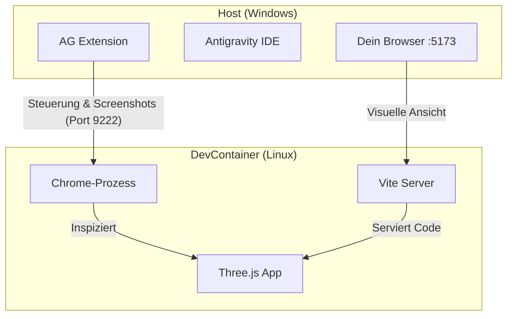

# Report: Browser-Integration & Rebuild-Rationale

Dieser Bericht fasst die technischen Hintergründe für den notwendigen Rebuild des "Nodges" DevContainers zusammen, insbesondere im Hinblick auf die Three.js Entwicklung mit Antigravity.

## 1. Die Problemstellung

Aktuell kann Antigravity (AG) die laufende Three.js Anwendung im DevContainer nicht visuell erfassen (Screenshots) oder tiefgreifend inspizieren. Dies liegt an einer fehlenden Kommunikationsbrücke zwischen dem isolierten Container und der Host-IDE.

## 2. Die Lösung: Die "Port-Dualität"

Um die Anwendung für Mensch und KI gleichermaßen nutzbar zu machen, wurden zwei Kanäle eingerichtet:

### A. Der Sicht-Kanal (Port 5173 - Vite)

* **Richtung:** Container → Host-Browser
* **Zweck:** Übertragung der Web-Inhalte.
* **Ergebnis:** Du kannst unter `http://localhost:5173` auf Windows die App sehen und interaktiv bedienen.

### B. Der Kontroll-Kanal (Port 9222 - CDP)

* **Richtung:** Host-IDE → Container-Chrome
* **Zweck:** Übertragung von Steuerbefehlen via *Chrome DevTools Protocol*.
* **Ergebnis:** Antigravity kann den Browser im Container fernsteuern, JS-Zustände auslesen und **Screenshots der WebGL-Canvas** anfordern.

## 3. Infrastruktur-Updates im Dockerfile

Damit komplexe Three.js Szenen korrekt gerendert und fotografiert werden können, wurden folgende Änderungen implementiert:

* **Google Chrome Stable:** Ersetzt das Standard-Chromium für höhere Stabilität bei WebGL.
* **OS-Abhängigkeiten:** Installation von `libgbm1`, `libnss3`, `libasound2` etc., die für das Rendering im "Headless"-Modus (ohne sichtbares Fenster im Container) essentiell sind.
* **GPU-Pass-Through:** Sicherstellung des Zugriffs auf `/dev/dri`, damit die Hardwarebeschleunigung für Three.js genutzt wird.

## 4. Datenfluss-Diagramm

## 5. Nächster Schritt: Der Rebuild

Die Änderungen an den "Bauplänen" (`Dockerfile` und `devcontainer.json`) sind hinterlegt. Damit diese physisch im Container ankommen (Installation der Pakete und Öffnung der Ports), musst du:

1. `Strg + Umschalt + P` drücken.
2. **"Dev Containers: Rebuild and Reopen in Container"** wählen.

Danach ist die Infrastruktur bereit für visuelle Aufgaben durch Antigravity.
