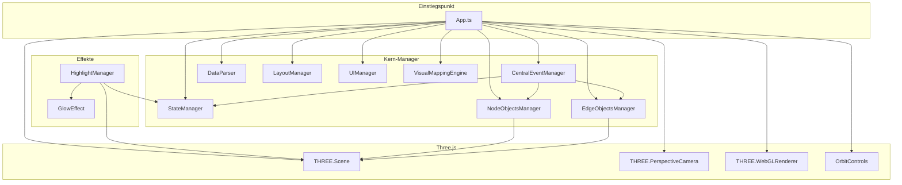
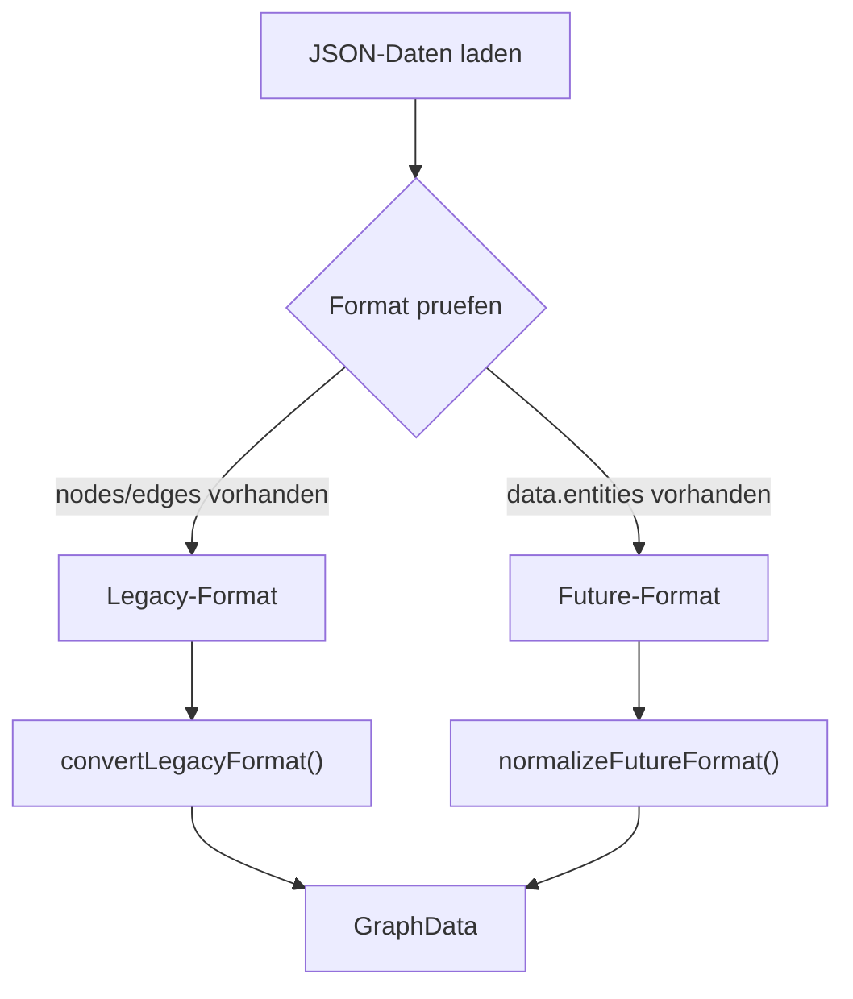
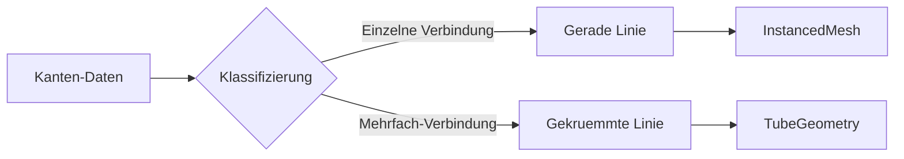
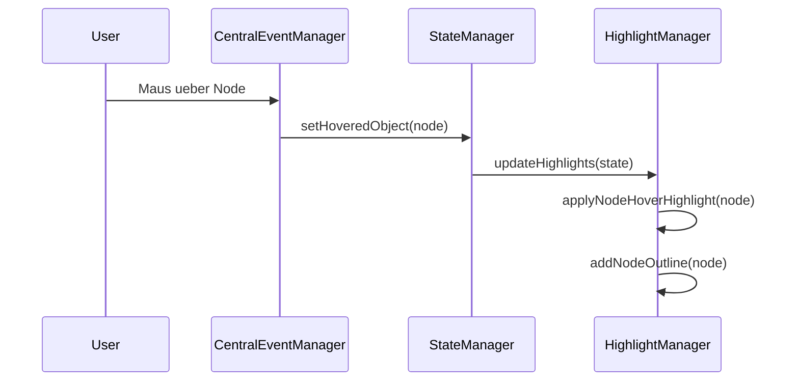
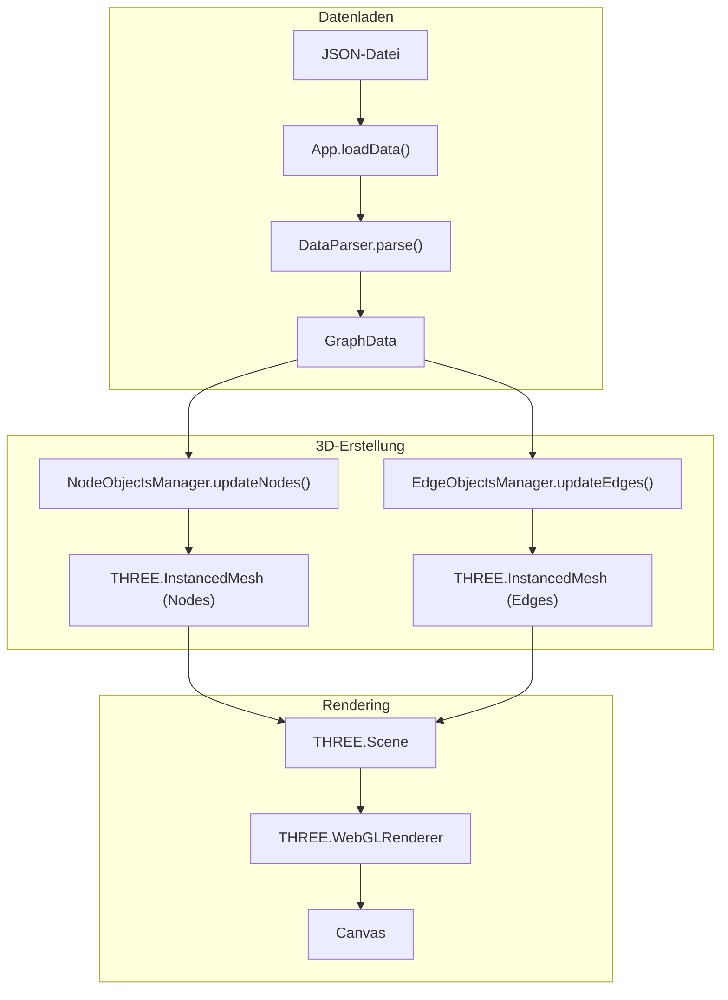
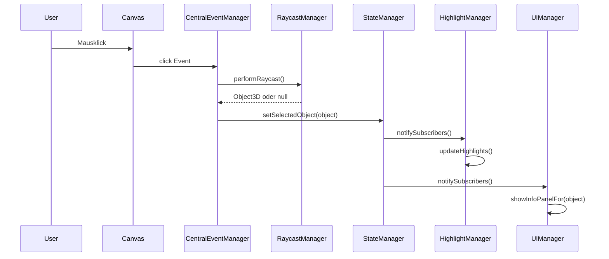

# Nodges - Ausfuehrlicher Projektbericht

## Projektuebersicht

**Nodges** ist eine interaktive 3D-Graphvisualisierungsanwendung, die mit **Three.js** und **TypeScript** entwickelt wurde. Das Projekt ermoeglicht die Visualisierung und Interaktion mit Netzwerkdaten in einer dreidimensionalen Umgebung.

| Eigenschaft | Wert |
|-------------|------|
| **Version** | 0.95 |
| **Build-System** | Vite |
| **Sprache** | TypeScript / JavaScript |
| **3D-Engine** | Three.js 0.161.0 |
| **Lizenz** | MIT |

---

## Technologie-Stack

### Produktionsabhaengigkeiten
- **Three.js** (v0.161.0) - 3D-Rendering-Engine
- **Tween.js** (v18.6.4) - Animationsbibliothek
- **lil-gui** (v0.19.1) - GUI-Steuerelemente
- **Zod** (v3.22.4) - Schema-Validierung

### Entwicklungsabhaengigkeiten
- **TypeScript** (v5.3.3)
- **Vite** (v5.1.4)
- **@types/three** und **@types/node**

---

## Projektstruktur

```
Nodges/
├── src/                          # Quellcode
│   ├── App.ts                    # Haupteinstiegspunkt
│   ├── types.ts                  # TypeScript-Typdefinitionen
│   ├── core/                     # Kern-Manager-Klassen
│   │   ├── StateManager.ts       # Zustandsverwaltung
│   │   ├── CentralEventManager.ts# Event-Handling
│   │   ├── DataParser.ts         # JSON-Datenverarbeitung
│   │   ├── NodeObjectsManager.ts # 3D-Knoten-Verwaltung
│   │   ├── EdgeObjectsManager.ts # 3D-Kanten-Verwaltung
│   │   ├── LayoutManager.ts      # Layout-Algorithmen
│   │   ├── UIManager.ts          # UI-Steuerung
│   │   └── VisualMappingEngine.ts# Visuelle Mappings
│   ├── effects/                  # Visuelle Effekte
│   │   ├── HighlightManager.js   # Highlight-System
│   │   └── GlowEffect.js         # Glow-Effekte
│   ├── utils/                    # Hilfsfunktionen (16 Dateien)
│   └── workers/                  # Web Workers
├── public/data/                  # JSON-Datendateien
└── index.html                    # Haupt-HTML
```

---

## Architektur-Diagramm



---

## Kernkomponenten im Detail

### 1. App.ts - Haupteinstiegspunkt

Die `App`-Klasse ist der zentrale Einstiegspunkt und orchestriert alle anderen Komponenten.

**Hauptfunktionen:**
- `init()` - Initialisiert die gesamte Anwendung
- `initThreeJS()` - Setzt Three.js Scene, Camera, Renderer auf
- `initManagers()` - Initialisiert alle Manager-Klassen
- `loadData(url)` - Laedt und verarbeitet JSON-Daten
- `createNodes()` / `createEdges()` - Erstellt 3D-Objekte
- `animate()` - Haupt-Render-Schleife

**Wichtige Eigenschaften:**
- `scene: THREE.Scene`
- `camera: THREE.PerspectiveCamera`
- `renderer: THREE.WebGLRenderer`
- `controls: OrbitControls`
- `stateManager: StateManager`

---

### 2. StateManager - Zustandsverwaltung

Der `StateManager` implementiert ein **reaktives Zustandsmuster** mit Subscriber-Benachrichtigungen.

**Zustandsobjekt (`State`):**
```typescript
interface State {
    hoveredObject: THREE.Object3D | null;
    selectedObject: THREE.Object3D | null;
    highlightedObjects: Set<THREE.Object3D>;
    glowIntensity: number;
    glowDirection: number;
    tooltipVisible: boolean;
    tooltipContent: string | null;
    tooltipPosition: { x: number, y: number } | null;
    infoPanelVisible: boolean;
    infoPanelCollapsed: boolean;
    highlightEffectsEnabled: boolean;
    isInteractionEnabled: boolean;
    currentTool: string;
    layoutEnabled: boolean;
}
```

**Wichtige Methoden:**
| Methode | Beschreibung |
|---------|--------------|
| `subscribe(callback, category)` | Registriert einen Zustandsaenderungs-Listener |
| `update(partialState)` | Aktualisiert den Zustand und benachrichtigt Subscriber |
| `setHoveredObject(object)` | Setzt das aktuell gehoverte Objekt |
| `setSelectedObject(object)` | Setzt das ausgewaehlte Objekt |
| `batchUpdate(updates)` | Fuehrt mehrere Updates atomisch durch |

---

### 3. CentralEventManager - Event-System

Der `CentralEventManager` ist das **zentrale Event-System** fuer alle Benutzerinteraktionen.

**Event-Typen:**
- Mouse-Events: `mousemove`, `mousedown`, `mouseup`, `click`, `dblclick`, `contextmenu`
- Keyboard-Events: `keydown`, `keyup`
- Window-Events: `resize`

**Architektur-Features:**
- **Publish/Subscribe-Pattern** fuer benutzerdefinierte Events
- **Debouncing** fuer Hover-Erkennung (100ms Verzoegerung)
- **Raycast-Integration** zur 3D-Objekt-Erkennung
- **HoverInfoPanel-Integration** fuer Tooltip-Anzeige

**Wichtige Methoden:**
| Methode | Beschreibung |
|---------|--------------|
| `handleMouseMove(event)` | Verarbeitet Mausbewegungen und Hover-States |
| `updateHoverState(object)` | Aktualisiert den Hover-Zustand |
| `updateSelectionState(object)` | Aktualisiert die Auswahl |
| `subscribe(eventType, callback)` | Registriert Event-Listener |
| `publish(eventType, data)` | Veroeffentlicht benutzerdefinierte Events |

---

### 4. DataParser - Datenverarbeitung

Der `DataParser` unterstuetzt **zwei Datenformate**: Legacy und Future.

**Datenformat-Erkennung:**


**Legacy-Format:**
```json
{
  "nodes": [{ "id": 1, "x": 0, "y": 0, "z": 0 }],
  "edges": [{ "start": 0, "end": 1 }]
}
```

**Future-Format:**
```json
{
  "system": "Name",
  "metadata": { ... },
  "dataModel": { ... },
  "visualMappings": { ... },
  "data": {
    "entities": [{ "id": "node1", "type": "node", "position": {...} }],
    "relationships": [{ "source": "node1", "target": "node2" }]
  }
}
```

---

### 5. NodeObjectsManager - Knoten-Verwaltung

Verwaltet die 3D-Darstellung von **Knoten/Nodes** mittels **InstancedMesh** fuer optimale Performance.

**Geometrie-Typen:**
- `sphere` - Kugel (Standard)
- `box` - Wuerfel
- `octahedron` - Oktaeder
- `icosahedron` - Ikosaeder

**Performance-Optimierungen:**
- **InstancedMesh** fuer effizientes Rendering vieler Objekte
- **Geometrie-Caching** zur Wiederverwendung
- **Material-Caching** zur Speicheroptimierung

**Wichtige Methoden:**
| Methode | Beschreibung |
|---------|--------------|
| `updateNodes(nodes)` | Erstellt/aktualisiert alle Knoten |
| `updateNodePositions(nodes)` | Aktualisiert nur Positionen |
| `setNodeColor(nodeId, color)` | Setzt Farbe eines Knotens |
| `getNodeAt(type, instanceId)` | Ruft Knotendaten ab |

---

### 6. EdgeObjectsManager - Kanten-Verwaltung

Verwaltet die 3D-Darstellung von **Kanten/Edges** als Zylinder.

**Rendering-Strategie:**


**Features:**
- Automatische Erkennung von Mehrfach-Verbindungen zwischen Knoten
- Dynamische Positionsaktualisierung bei Layout-Aenderungen
- Instance-zu-EdgeData-Mapping fuer Interaktionen

---

### 7. LayoutManager - Layout-Algorithmen

Bietet **8 verschiedene Layout-Algorithmen** fuer die Graph-Anordnung.

**Verfuegbare Layouts:**

| Layout | Beschreibung |
|--------|--------------|
| `force` | Kraft-gerichtetes Layout |
| `circular` | Kreisfoermige Anordnung |
| `grid` | Rasteranordnung |
| `random` | Zufaellige Verteilung |
| `fruchterman` | Fruchterman-Reingold-Algorithmus |
| `spring` | Spring-Embedder-Layout |
| `hierarchical` | Hierarchische Anordnung |
| `tree` | Baum-Layout |

**Web Worker-Integration:**
Rechenintensive Layouts werden in einem **Web Worker** ausgefuehrt, um die UI nicht zu blockieren.

---

### 8. HighlightManager - Highlight-System

Verwaltet **visuelle Hervorhebungen** fuer Hover- und Auswahl-Zustaende.

**Highlight-Typen:**
- `hover` - Temporaere Hervorhebung bei Maus-Hover
- `selection` - Dauerhafte Hervorhebung bei Auswahl
- `search` - Suchergebnis-Hervorhebung
- `path` - Pfad-Hervorhebung
- `group` - Gruppenhervorhebung

**Effekte:**
- **Glow-Effekt** ueber separate Outline-Meshes
- **Farbaenderung** des Materials
- **Animierte Glow-Intensitaet**

**Node-Highlight:**


---

### 9. UIManager - Benutzeroberflaeche

Verwaltet alle **HTML-UI-Komponenten**.

**UI-Panels:**
- **File Info Panel** - Zeigt Dateiinformationen (Version, Knoten, Kanten)
- **File Panel** - Dateiauswahl
- **Info Panel** - Objektdetails bei Auswahl
- **Dev Panel** - Entwickleroptionen

**Features:**
- Panel-Toggling (Ein-/Ausklappen)
- Dynamische Dateiliste aus dem `/data`-Verzeichnis
- FPS-Anzeige
- Highlight-Toggle

---

## Datenfluss-Diagramm



---

## Interaktionssystem



---

## Typdefinitionen

Das Projekt verwendet umfangreiche **TypeScript-Interfaces** in [types.ts](file:///c:/Users/ich/Desktop/code/Antigravity/Antigravity_2025_11_clone/Nodges/src/types.ts):

**Wichtige Typen:**

| Interface | Beschreibung |
|-----------|--------------|
| `NodeData` | Legacy-Knoten-Format |
| `EdgeData` | Legacy-Kanten-Format |
| `EntityData` | Future-Format-Entitaet |
| `RelationshipData` | Future-Format-Beziehung |
| `GraphData` | Hauptdatenstruktur |
| `DataModel` | Schema-Definition |
| `VisualMappings` | Visuelle Mapping-Konfiguration |
| `AppState` | Anwendungszustand |

---

## Beispiel-Datendatei

Die Anwendung enthaelt mehrere Beispieldateien in `/public/data/`:

| Datei | Beschreibung |
|-------|--------------|
| `small.json` | 3 Knoten, 4 Kanten (Testdatei) |
| `medium.json` | Mittelgrosser Graph |
| `ikosaeder.json` | Ikosaeder-Struktur |
| `tetraeder.json` | Tetraeder-Struktur |
| `eins.json` | Einfaches Beispiel |

---

## Performance-Optimierungen

1. **InstancedMesh** - Effizientes Rendering vieler gleichartiger Objekte
2. **Web Workers** - Layout-Berechnungen im Hintergrund
3. **Geometrie-Caching** - Wiederverwendung von Geometrien
4. **Material-Caching** - Wiederverwendung von Materialien
5. **Debounced Hover** - Verzoegerte Hover-Erkennung (100ms)
6. **Batch-Updates** - Atomische Zustandsaktualisierungen

---

## Zusammenfassung

Nodges ist eine **gut strukturierte, modulare 3D-Graphvisualisierungs-Anwendung** mit:

- **Klarer Trennung von Verantwortlichkeiten** (Manager-Pattern)
- **Reaktivem Zustandsmanagement** (StateManager mit Pub/Sub)
- **Unterstuetzung von Legacy und modernen Datenformaten**
- **8 verschiedenen Layout-Algorithmen**
- **Umfangreichem Highlight-System** fuer visuelle Rueckmeldung
- **Performance-Optimierungen** durch InstancedMesh und Web Workers
